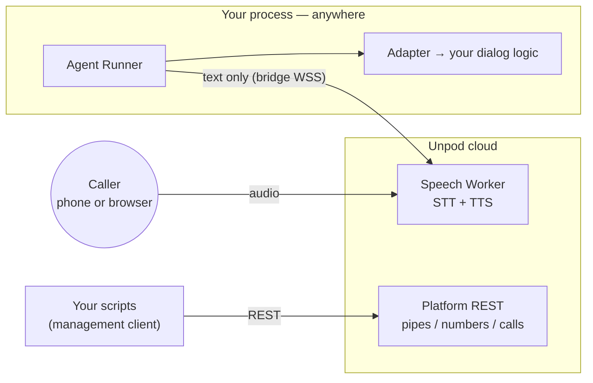

# Unpod SDK — Overview

Unpod SDK (`pip install unpod`) is the Python package for putting your own
dialog logic on a live voice call. Unpod runs the voice side — telephony,
audio, speech-to-text, text-to-speech; you run the text side — a long-lived
**Agent Runner** process hosting your dialog logic. The one architectural
commitment: the wire between the two carries **text, never audio**.

## What Unpod owns vs what you own

| Unpod (infrastructure) | You (the developer) |
|---|---|
| PSTN / SIP carrier legs and phone numbers (`client.telephony`) | Dialog logic: Playbook, LangChain chain, HTTP service, MCP server, or raw LLM calls |
| Media rooms and audio transport (phone, WebSocket, WebRTC) | LLM choice — and your own LLM API billing (the OpenAI/Anthropic adapters take a client *you* construct) |
| STT + TTS — the Speech Worker; audio never reaches your code | Prompts, tools, business logic, conversation memory |
| Voice-profile catalog (read-only, resolved by name) | Where your Agent Runner runs: your laptop, your server, or Unpod-hosted via Publish |
| Call dispatch: Pipe resolution, runner pick by `agent_id`, failover | The `agent_id` — the rendezvous key that ties your runner to Pipes and numbers |
| Recording and transcript capture (`client.recordings`, `client.transcripts`) | |
| Voice-minute billing | |

## Terminology

The same canon is used across all Unpod docs. The **In code/logs** column names
symbols and log prefixes inside Unpod's own services — `publish/`,
`brain_resolver.py`, `playbook_pool/` and `contracts/dispatch_protocol.py` live
in supervoice, not in this package. Publish in particular has no SDK surface
yet: nothing under `src/unpod` mentions it, and the only place these docs touch
it is the outbound publish gate in
[01-quickstart.md § Known gaps](01-quickstart.md#known-gaps) (#2).

| Canonical name | Meaning | In code/logs | Deprecated aliases |
|---|---|---|---|
| **Speech Worker** | Voice-side worker. Joins the media room with STT/TTS (PipeCat pipeline). Audio never leaves it. | `worker/`, "media worker" in comments | media agent, speech agent, PipeWorker, pipecat side |
| **Agent Runner** | Text-side worker: the developer's (or playbook pool's) long-lived process running the brain. Registers under an `agent_id`. | "brain runner" (`brain_resolver.py`, `brain_assign.py`), `playbook_pool/`, `[pbpool]` log prefix | agent worker, brain |
| **Pipe** | Voice profile + `agent_id` binding, attachable to numbers. Many pipes may share one `agent_id`. | `Pipe`, `pipe_id` | speech pipe (prose form is fine), **Identity** (doc-only model; does not exist in code) |
| **Playbook** | SuperDialog artifact the Agent Runner executes. | `Playbook`, `playbook_id` | — |
| **Publish** | Managed hosting of an Agent Runner on Unpod cloud. Today: playbook-pool processes; roadmap: Docker per agent. | `publish/` saga | deploy (reserved for the three deployment mechanisms) |
| **Transport: `serve` / `dial_out`** | Who connects to whom on the text bus. `dial_out` (current): the Agent Runner dials the Speech Worker's bridge acceptor. `serve` (deprecated, teardown scheduled): the runner serves, the worker dials. | `contracts/dispatch_protocol.py::WorkerCapabilities.transport` | "the runner serves the bridge" (03's stale locked model) |

Runner registration, `worker_id` reconnection, and pooling several runners
under one `agent_id` are covered in
[04-connectivity-sdk.md](04-connectivity-sdk.md).

## How a call reaches your code



At call time the platform resolves the Pipe, the orchestrator picks a live
Agent Runner registered under the Pipe's `agent_id`, and a Speech Worker
joins the media room. The runner then dials the worker's bridge (`dial_out`,
the default in `connectivity/runner.py::AgentRunner`) and exchanges text
turns. The full sequence, as observed live, is in
[01-quickstart.md](01-quickstart.md).

## Media transports (as shipped)

Every media path converges on the same Speech Worker runtime — your Agent
Runner sees identical text turns regardless of how the audio arrives (the
speech service's transport registry, supervoice
`worker/pipeline/transports.py`, holds exactly three kinds: `livekit`,
`websocket`, `webrtc`).

| Path | Status | How it connects |
|---|---|---|
| Phone (PSTN/SIP) | Shipped, hosted | Attach a number to your `agent_id` (`client.telephony.numbers.attach`); calls join a LiveKit room where the Speech Worker runs |
| Browser WebSocket | Shipped, self-hosted | Client-session ingress: `POST /v1/sessions` (Bearer session API key) returns a `wss_url`; audio streams over `WS /ws/audio` |
| Browser WebRTC | Shipped, self-hosted | Same ingress with `transport="webrtc"`: returns a `webrtc_offer_url`; SmallWebRTC signaling over `POST /webrtc/offer` |

The two browser rows are the client-session ingress of the speech service
(supervoice `dev/app.py::create_dev_app`) — the surface the browser playground
uses. That ingress mints its connect URLs against its own host, so today the
browser paths run against a speech service you start yourself rather than a
hosted Unpod endpoint. Your side is identical either way: the Agent Runner
registers under an `agent_id` and receives the same text turns. See
[06-browser-quickstart.md](06-browser-quickstart.md).

## Package scope

### Management client (REST)

`AsyncClient` / `Client` (`client.py`) expose two planes. `UNPOD_BASE_URL` is
the one knob both bases are *derived* from
(`_base_url.py::service_base`, `_base_url.py::platform_base`):
`https://<host>/platform` for the management plane,
`https://<host>/api/v2/platform` for the telephony plane. Derivation is all it
does — setting it is not by itself enough to make every resource reachable
(see the wrinkle below). Per-component overrides still win over the derived
value where they are set (`_base_url.py` module docstring): the one that
matters here is **`UNPOD_SERVICE_BASE_URL`**, the management base, resolved
`base_url=` arg → `UNPOD_SERVICE_BASE_URL` → derived from `UNPOD_BASE_URL` →
`https://api.unpod.ai/platform` (`client.py::AsyncClient.__init__`). The Agent
Runner has its own (`UNPOD_ORCHESTRATOR_URL`, `connectivity/runner.py`).

| Namespace | Plane | What it does |
|---|---|---|
| `client.pipes`, `client.calls`, `client.numbers`, `client.trunks`, `client.sessions`, `client.recordings`, `client.transcripts`, `client.api_keys` | Management, `https://<host>/platform` | Pipes, outbound calls, numbers synced from LiveKit SIP trunks, sessions, recordings, transcripts, API keys |
| `client.telephony` (numbers, trunks BETA, `overview()`), `client.voice_profiles` | Telephony, `https://<host>/api/v2/platform` | The primary number-attach flow (`numbers.attach(..., agent_id=)`), voice-profile catalog |

One auth strategy serves both planes, chosen for you in
`client.py::AsyncClient.__init__`: `UNPOD_PLATFORM_TOKEN` (+ `UNPOD_ORG_HANDLE`)
when set, otherwise Bearer `UNPOD_API_KEY`. The telephony plane is
`Org-Handle`-scoped and rejects a bare Bearer key, so the token form is the one
most flows want.

One wrinkle to know before your first call: **no single base URL currently
serves every management resource.** `client.pipes`, `client.calls` and
`client.numbers` spell a hosted-proxy prefix inside their own request paths
(`/api/v2/platform/speech/v1/...`, plus `/api/v2/platform/telephony/...` for
`numbers.list`, `delete`, `release` and `attach`), while `client.sessions`,
`client.recordings`, `client.transcripts`, `client.api_keys` and
`client.trunks` request bare `/v1/...` — and they share the same HTTP client
(`client.py::AsyncClient.__init__`); session lifecycle ops
(`management/sessions.py::SessionsResource.end`, `.transfer`, `.merge`)
additionally run on a second client whose base swaps a trailing `/platform`
for `/orchestrator` and otherwise reuses the same value
(`UNPOD_ORCHESTRATOR_BASE_URL` overrides it) — so a 404 there is a different
base from the rest of the table. Whichever value of
`UNPOD_SERVICE_BASE_URL` you pick, one of the two halves breaks; against a
locally started supervoice, neither half works.
[01-quickstart.md § Known gaps](01-quickstart.md#known-gaps) records the
workaround the verified run used and what a real fix requires.
[03-management-sdk.md](03-management-sdk.md) is the resource-by-resource
reference for both planes: it repeats this wrinkle as a callout, spells out the
`UNPOD_PLATFORM_TOKEN` auth precedence, and gives the verdict on the two number
surfaces.

### Connectivity runtime (WSS)

The runtime classes exported at top level (`src/unpod/__init__.py`, which
also exports the auth classes): **`AgentRunner`** — the
long-lived process that registers under your `agent_id` and receives calls;
**`Session`** — the per-call object with hooks and controls; **`CallContext`**
— the per-call metadata envelope handed to your entrypoint.
[04-connectivity-sdk.md](04-connectivity-sdk.md) covers all three, including
the one trap worth knowing up front: `HookRegistry` accepts any name in
`connectivity/hooks.py::VALID_EVENTS`, so registration succeeds for four hooks
that nothing ever raises. That doc splits the hooks that fire from the ones
that do not, against the `fire()` calls in `connectivity/session.py` and
`observability/__init__.py`.

### Adapters

Six adapters plug your dialog logic into `Session.dialog_machine`, all
implementing the `DialogAdapter` protocol (`adapters/__init__.py`):

| Adapter | Wraps | Install |
|---|---|---|
| `SuperDialogAdapter` | a SuperDialog `DialogMachine` / `LLMAgent` | `unpod[dialog]` |
| `LangChainAdapter` | any LangChain Runnable (`ainvoke`/`astream`) | `unpod[langchain]` |
| `HTTPAdapter` | your HTTP endpoint (POST per turn) | core |
| `MCPAdapter` | an MCP server (tools + LLM orchestration) | `unpod[mcp]` |
| `OpenAIAdapter` | an `openai.AsyncOpenAI` client you construct | core (bring `openai`) |
| `AnthropicAdapter` | an `anthropic.AsyncAnthropic` client you construct | core (bring `anthropic`) |

On a live call the hot path is `stream()`, not `turn()` — `adapters/base.py`
says so outright ("`turn()` … not called during live calls";
"`stream()` … THIS is the hot path called by `session.run()`").
[04-adapters.md](04-adapters.md) has the protocol shape and the per-adapter
options, but it predates this canon and leads with `turn()` as the contract:
read it with that inversion in mind, and take `stream()` as the method to
implement first in a custom adapter.

## Installation

```bash
pip install unpod                # core: management client + connectivity runtime
pip install "unpod[dialog]"      # + superdialog (recommended)
pip install "unpod[langchain]"   # + LangChain adapter deps
pip install "unpod[mcp]"         # + MCP adapter deps
pip install "unpod[observability]"  # + Langfuse tracing (LANGFUSE_SECRET_KEY)
```

## Docs

| Doc | Content |
|---|---|
| [01-quickstart.md](01-quickstart.md) | Install → Pipe → Agent Runner → number → first call, transcribed from a live verified run |
| [03-management-sdk.md](03-management-sdk.md) | Resource-by-resource REST reference for both planes: the `client.telephony.numbers.attach` verdict and its platform-agent precondition, auth precedence (`UNPOD_PLATFORM_TOKEN` beats `UNPOD_API_KEY`), the base-URL split above carried as a known gap, the per-plane number-status vocabularies, and the three unrelated types named `Session` |
| [04-connectivity-sdk.md](04-connectivity-sdk.md) | `AgentRunner` / `Session` reference: constructor parameters, runner stats, `CallContext`, the ten hooks that actually fire (including `state` and `error`) versus the four that never do, controls, transfers, and the broken surface (`set_filler`, `recording.*`, `metrics.live()`) called out as gaps |
| [04-adapters.md](04-adapters.md) | **Pending revamp, and pending renumber to `05-adapters.md`** — it shares the `04` ordinal with connectivity until that rename lands. Predates this canon: `DialogAdapter` protocol reference; says the SDK ships four adapters (six are exported) and presents `turn()` as "the contract every adapter must satisfy", inverting the `stream()` hot path stated in `adapters/base.py` |
| [05-architecture.md](05-architecture.md) | **Pending revamp — predates this canon.** Frame-level bridge/dispatch reference; says "brain" and "media worker", omits `telephony/` and the `openai.py`/`anthropic.py` adapters, still documents `serve`-mode frames |
| [06-browser-quickstart.md](06-browser-quickstart.md) | Talk to your agent from a browser |
