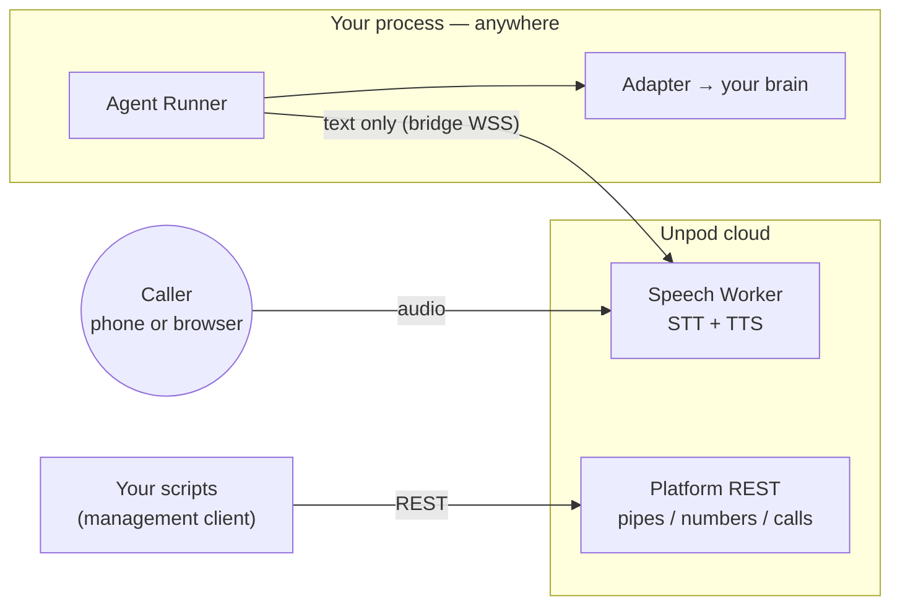

# Unpod SDK — Overview

Unpod SDK (`pip install unpod`) is the Python package for putting your own
dialog logic on a live voice call. Unpod runs the voice side — telephony,
audio, speech-to-text, text-to-speech; you run the text side — a long-lived
**Agent Runner** process hosting your brain. The one architectural commitment:
the wire between the two carries **text, never audio**.

## What Unpod owns vs what you own

| Unpod (infrastructure) | You (the developer) |
|---|---|
| PSTN / SIP carrier legs and phone numbers (`client.telephony`) | Dialog logic: Playbook, LangChain chain, HTTP service, MCP server, or raw LLM calls |
| Media rooms and audio transport (phone, WebSocket, WebRTC) | LLM choice — and your own LLM API billing (the OpenAI/Anthropic adapters take a client *you* construct) |
| STT + TTS — the Speech Worker; audio never reaches your code | Prompts, tools, business logic, conversation memory |
| Voice-profile catalog (read-only, resolved by name) | Where your Agent Runner runs: your laptop, your server, or Unpod-hosted via Publish |
| Call dispatch: Pipe resolution, runner pick by `agent_id`, failover | The `agent_id` — the rendezvous key that ties your runner to Pipes and numbers |
| Recording and transcript capture (`client.recordings`, `client.transcripts`) | |
| Voice-minute billing | |

## Terminology

The same canon is used across all Unpod docs:

| Canonical name | Meaning | In code/logs | Deprecated aliases |
|---|---|---|---|
| **Speech Worker** | Voice-side worker. Joins the media room with STT/TTS (PipeCat pipeline). Audio never leaves it. | `worker/`, "media worker" in comments | media agent, speech agent, PipeWorker, pipecat side |
| **Agent Runner** | Text-side worker: the developer's (or playbook pool's) long-lived process running the brain. Registers under an `agent_id`. | "brain runner" (`brain_resolver.py`, `brain_assign.py`), `playbook_pool/`, `[pbpool]` log prefix | agent worker, brain |
| **Pipe** | Voice profile + `agent_id` binding, attachable to numbers. Many pipes may share one `agent_id`. | `Pipe`, `pipe_id` | speech pipe (prose form is fine), **Identity** (doc-only model; does not exist in code) |
| **Playbook** | SuperDialog artifact the Agent Runner executes. | `Playbook`, `playbook_id` | — |
| **Publish** | Managed hosting of an Agent Runner on Unpod cloud. Today: playbook-pool processes; roadmap: Docker per agent. | `publish/` saga | deploy (reserved for the three deployment mechanisms) |
| **Transport: `serve` / `dial_out`** | Who connects to whom on the text bus. `dial_out` (current): the Agent Runner dials the Speech Worker's bridge acceptor. `serve` (deprecated, teardown scheduled): the runner serves, the worker dials. | `contracts/dispatch_protocol.py::WorkerCapabilities.transport` | "the runner serves the bridge" (03's stale locked model) |

The identity trio your runner registers with — `agent_id`, `worker_id`,
`pool` — is defined in [02-run-your-agent.md](02-run-your-agent.md).

## How a call reaches your code



At call time the platform resolves the Pipe, the orchestrator picks a live
Agent Runner registered under the Pipe's `agent_id`, and a Speech Worker
joins the media room. The runner then dials the worker's bridge (`dial_out`,
the default in `connectivity/runner.py::AgentRunner`) and exchanges text
turns. The full sequence, as observed live, is in
[01-quickstart.md](01-quickstart.md).

## Media transports (as shipped)

Every media path converges on the same Speech Worker runtime — your Agent
Runner sees identical text turns regardless of how the audio arrives
(supervoice `worker/pipeline/transports.py` registers exactly three kinds:
`livekit`, `websocket`, `webrtc`).

| Path | Status | How it connects |
|---|---|---|
| Phone (PSTN/SIP) | Shipped | Attach a number to your `agent_id` (`client.telephony.numbers.attach`); calls join a LiveKit room where the Speech Worker runs |
| Browser WebSocket | Shipped | Speech service session ingress: `POST /v1/sessions` (API-key auth) returns a `wss_url`; audio streams over `WS /ws/audio` |
| WebRTC | Shipped | Same ingress with `transport="webrtc"`: returns a `webrtc_offer_url`; SmallWebRTC signaling via `POST /webrtc/offer` |

The WebSocket and WebRTC rows are the client-session ingress of the speech
service (supervoice `dev/app.py::create_dev_app`) — the same surface the
browser playground uses. See
[07-browser-quickstart.md](07-browser-quickstart.md).

## Package scope

### Management client (REST)

`AsyncClient` / `Client` (`client.py`) expose two planes, both derived from
the single `UNPOD_BASE_URL` knob (`_base_url.py`):

| Namespace | Plane / auth | What it does |
|---|---|---|
| `client.pipes`, `client.calls`, `client.numbers`, `client.trunks`, `client.sessions`, `client.recordings`, `client.transcripts`, `client.api_keys` | Management plane, Bearer `UNPOD_API_KEY` | Pipes, outbound calls, LiveKit-trunk numbers, recordings, transcripts |
| `client.telephony` (numbers, trunks BETA, `overview()`), `client.voice_profiles` | Telephony plane, org-scoped `UNPOD_PLATFORM_TOKEN` + `UNPOD_ORG_HANDLE` | The primary number-attach flow (`numbers.attach(..., agent_id=)`), voice-profile catalog |

The two planes, their auth precedence, and which one to use are covered in
[03-management-sdk.md](03-management-sdk.md).

### Connectivity runtime (WSS)

The runtime classes exported at top level (`src/unpod/__init__.py`, which
also exports the auth classes): **`AgentRunner`** — the
long-lived process that registers under your `agent_id` and receives calls;
**`Session`** — the per-call object with hooks and controls; **`CallContext`**
— the per-call metadata envelope handed to your entrypoint. Details in
[04-connectivity-sdk.md](04-connectivity-sdk.md).

### Adapters

Six adapters plug a brain into `Session.dialog_machine`, all implementing the
`DialogAdapter` protocol (`adapters/__init__.py`):

| Adapter | Wraps | Install |
|---|---|---|
| `SuperDialogAdapter` | a SuperDialog `DialogMachine` / `LLMAgent` | `unpod[dialog]` |
| `LangChainAdapter` | any LangChain Runnable (`ainvoke`/`astream`) | `unpod[langchain]` |
| `HTTPAdapter` | your HTTP endpoint (POST per turn) | core |
| `MCPAdapter` | an MCP server (tools + LLM orchestration) | `unpod[mcp]` |
| `OpenAIAdapter` | an `openai.AsyncOpenAI` client you construct | core (bring `openai`) |
| `AnthropicAdapter` | an `anthropic.AsyncAnthropic` client you construct | core (bring `anthropic`) |

On a live call the hot path is `stream()`, not `turn()` — see
[05-adapters.md](05-adapters.md) before writing a custom adapter.

## Installation

```bash
pip install unpod                # core: management client + connectivity runtime
pip install "unpod[dialog]"      # + superdialog (recommended)
pip install "unpod[langchain]"   # + LangChain adapter deps
pip install "unpod[mcp]"         # + MCP adapter deps
pip install "unpod[observability]"  # + Langfuse tracing (LANGFUSE_SECRET_KEY)
```

## Docs

| Doc | Content |
|---|---|
| [01-quickstart.md](01-quickstart.md) | Install → Pipe → Agent Runner → number → first call, transcribed from a live verified run |
| [02-run-your-agent.md](02-run-your-agent.md) | Local runner vs Publish, identity trio, reconnection and failover |
| [03-management-sdk.md](03-management-sdk.md) | Both REST planes, auth precedence, which numbers API to use |
| [04-connectivity-sdk.md](04-connectivity-sdk.md) | `AgentRunner`, `Session`, the hooks that actually fire |
| [05-adapters.md](05-adapters.md) | `DialogAdapter` protocol, the six adapters, `stream()` as the hot path |
| [06-deployment.md](06-deployment.md) | Three deployment mechanisms, each labeled Shipped or Roadmap |
| [07-browser-quickstart.md](07-browser-quickstart.md) | Talk to your agent from a browser |
