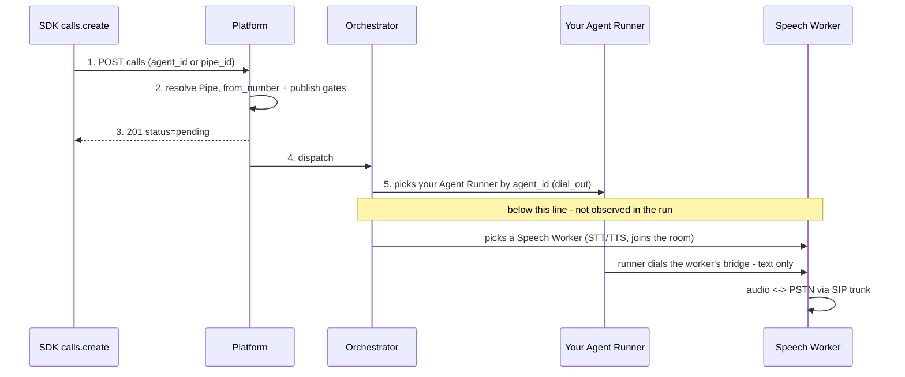

# Quickstart — first agent, first call

From install to a dispatched outbound call with the SDK surface as it exists
today. This doc is a transcription of a live verification run (2026-07-28)
against a locally started Unpod platform — the full transcript, including every
failure, is in [plans/2026-07-28-quickstart-run.md](plans/2026-07-28-quickstart-run.md).
Terms used throughout: a **Pipe** binds a voice profile to an `agent_id`; your
**Agent Runner** is the text-side process running your dialog logic; the
**Speech Worker** is Unpod's voice-side worker (STT/TTS — audio never reaches
your code); a **Playbook** is a SuperDialog artifact an Agent Runner executes.

## How this doc was verified

Every code block below that calls the SDK either ran in the live verification
run, or carries an explicit *"verified against code, not yet run live"* marker.
The one exception is the step-1 configuration block: it shows the values a
hosted deployment wants, not the ones the run used — the run pointed every
plane at `http://localhost:8000` through the per-component overrides. The run's
environment had no SIP trunk and no Speech Worker, so the final audio leg
(the actual PSTN dial) is static-only; everything up to and including the
orchestrator picking the Agent Runner ran live. The SDK's management wrappers
(`pipes.*`, `calls.*`, `numbers.*`) carry markers because of known gap #1
below — the `pipes` and `calls` request bodies were executed live against the
platform's own API instead, and succeeded; `numbers.sync()` was not exercised
in any form. The live run used `agent_id="docs-quickstart-run"`
throughout; the blocks below rename it `my-voice-agent` and, where noted,
differ as each step's own marker records, so verbatim outputs (worker JSON,
ids) show the run's name.

## 0 — Install

```bash
pip install "unpod[dialog]"
```

*Verified against code (`pyproject.toml` — the `dialog` extra pulls
`superdialog`, used by the entrypoint below), not yet run live: the
verification run used an editable install.*

## 1 — Configure

```bash
export UNPOD_BASE_URL="https://api.unpod.ai"   # or your deployment's host
export UNPOD_API_KEY="sk_..."

# Bare host: what pipes/calls/numbers need instead of the derived base URL.
export UNPOD_SERVICE_BASE_URL="https://api.unpod.ai"   # no path segment
# Org-scoped auth for the REST planes. (The AgentRunner in step 3 is the one
# thing that still wants UNPOD_API_KEY: it sends it as a Bearer token.)
export UNPOD_PLATFORM_TOKEN="..."                      # DRF token
export UNPOD_ORG_HANDLE="your-org"
```

`UNPOD_BASE_URL` is the single configuration knob for three of the four
surfaces; every endpoint the SDK touches is derived from it in `_base_url.py` —

| Surface | Derived from `UNPOD_BASE_URL` | Usable as derived? |
|---|---|---|
| Orchestrator WebSocket (`AgentRunner`) | `wss://<host>` | yes |
| Telephony / voice-profile plane (`client.telephony`, `client.voice_profiles`) | `https://<host>/api/v2/platform` | yes |
| Management REST, direct-supervoice paths (`client.sessions`, `client.transcripts`, `client.recordings`, `client.api_keys`, `client.trunks`) | `https://<host>/platform` | yes |
| Management REST, proxy paths (`client.pipes`, `client.calls`, `client.numbers`) | `https://<host>/platform` | **no** — override with the bare host |

The last row is the one this quickstart leans on hardest. `pipes`, `calls` and
`numbers` spell the hosted proxy's full prefix inside their own request paths —
`management/pipes.py::PipesResource.create` posts
`/api/v2/platform/speech/v1/pipes` — and httpx appends that to the base, so the
derived `https://<host>/platform` yields
`https://<host>/platform/api/v2/platform/speech/v1/pipes`, a doubled prefix no
deployment serves. Setting `UNPOD_SERVICE_BASE_URL` to the bare host (the shape
the SDK's own fixture uses in `tests/test_management.py`) makes those paths land
on the real route: unpod backend-core mounts `api/v2/platform/speech/` at host
root (`config/urls.py`) and its `v1/pipes`, `v1/calls`, `v1/numbers/sync` routes
forward verbatim to supervoice `/platform/v1/...` (`unpod/speech/urls.py`).

Three consequences, all load-bearing:

- That proxy authenticates with a DRF token or a platform JWT and resolves your
  org from `Org-Handle` (`unpod/speech/views.py::PipesViewSet`), so
  `UNPOD_PLATFORM_TOKEN` + `UNPOD_ORG_HANDLE` is what reaches it. A Bearer
  `UNPOD_API_KEY` is rejected there.
- The bare-host override breaks the third row in the other direction: those
  resources post `/v1/...` and need the `/platform` base. No single base URL
  serves both halves today — known gap #1.
- Against a **locally started supervoice**, with no backend-core proxy in front,
  neither value works for `pipes`/`calls`/`numbers`; the verification run drove
  those resources against the platform's own API instead — the exact requests
  are in the next subsection, so a local stack can still complete this
  quickstart.

Per-component overrides (`UNPOD_SERVICE_BASE_URL`, `UNPOD_ORCHESTRATOR_URL`,
`UNPOD_PLATFORM_BASE_URL`) always win when set — the verification run used them
to point every plane at `http://localhost:8000`.

### On a local stack: steps 2, 5 and 7 by direct request

Step 3 needs nothing special — the runner reads `UNPOD_ORCHESTRATOR_URL` and
registers over WSS as it does anywhere. Step 4's primary flow is not completable
locally: `client.telephony.*` targets backend-core's `/api/v2/platform` plane,
which a bare supervoice does not serve (the run's `voice_profiles.list()` 404 on
`/api/v2/platform/voice-profiles/` is the same wall). Its `numbers.sync()`
sub-note does have a local route — `POST /platform/v1/numbers/sync`,
`platform/routers/numbers.py::sync_numbers` — but it imports numbers from
LiveKit SIP inbound trunks, and the run had none configured. For steps 2, 5
and 7, address supervoice's own routes instead — the form the run used:

```bash
KEY="sk_..."   # Bearer api key; no platform token, no org handle needed

# step 2 — create the Pipe
curl -X POST http://localhost:8000/platform/v1/pipes \
  -H "Authorization: Bearer $KEY" -H "Content-Type: application/json" \
  -d '{"name":"my-voice-agent","agent_id":"my-voice-agent"}'

# step 5 — dispatch the call (from_number required; see gate 1 in step 5)
curl -X POST http://localhost:8000/platform/v1/calls \
  -H "Authorization: Bearer $KEY" -H "Content-Type: application/json" \
  -d '{"agent_id":"my-voice-agent","to_number":"+19995550001","from_number":"+14155550101"}'

# step 7 — monitor
curl http://localhost:8000/platform/v1/calls -H "Authorization: Bearer $KEY"
```

Those paths are the composition root's: supervoice mounts its platform sub-app
at `/platform` with every router under `/v1` (`main.py::_build_app`,
`platform/main.py::create_platform_app`, plus `telephony/api/calls.py`'s router
included at the same prefix), and a Bearer api key authenticates them directly
(`platform/auth.py::get_auth_context`). The bodies are the ones the SDK wrappers
would have sent. Everything else in this quickstart — the runner, both step-5
gates, the dispatch — behaves identically; only the transport of those three
requests differs. On a hosted deployment behind the backend-core proxy the SDK
wrappers are the right call and all seven steps read as written.

> **Auth precedence.** `UNPOD_PLATFORM_TOKEN` beats `UNPOD_API_KEY` whenever
> it is set: the client switches to token auth scoped by `UNPOD_ORG_HANDLE` and
> never sends your Bearer api key (`client.py::AsyncClient.__init__`). That is
> the auth this quickstart wants — but it is silent, so if you *meant* to hit
> supervoice directly in Bearer mode and see org-scoped 401s, check for an
> inherited `UNPOD_PLATFORM_TOKEN` first. The SDK also calls `load_dotenv()` on
> import, so a `.env` file in your working directory counts as "set".

## 2 — Create a Pipe

A Pipe binds a voice profile to an `agent_id` — the rendezvous key your Agent
Runner registers under. The real signature
(`management/pipes.py::PipesResource.create`):

```python
from unpod import AsyncClient

client = AsyncClient()
pipe = await client.pipes.create(
    name="my-voice-agent",
    voice_profile="Alloy",        # optional; catalog name or profile_id
    agent_id="my-voice-agent",    # must match your AgentRunner's agent_id
    recording=False,
    max_call_duration_s=600,
)
print(pipe.pipe_id)               # PIPE_...
```

*Verified against code, not yet run live via the SDK (known gap #1). The
equivalent create body ran live against the platform's own API and returned
201 with the `agent_id` bound; the `"Alloy"` name-to-profile-id resolution was
live-verified on a pipe update in the same run (transcript, stage 3).*

The signature has one more optional parameter, not shown: `agent_endpoint`, a
static runner URL the platform falls back to when no live Agent Runner is
registered under the pipe's `agent_id` (supervoice
`telephony/inbound/handler.py::handle_inbound_join`). That fallback takes the
legacy `serve` transport — the platform connects *to* your URL — so it needs a
publicly reachable server and is not a stand-in for the `dial_out` runner of
step 3. This quickstart does not need it.

Notes, all observed live:

- There is **no** `system_prompt`, `first_message`, or `first_speaker`
  parameter. What the agent says lives in your entrypoint code (step 3), not
  in the Pipe.
- `voice_profile` is optional at create time and accepts **either a catalog
  name or a `profile_id`**: supervoice
  `platform/routers/pipes.py::_resolve_voice_profile` tries `profile_id` first,
  then a case-insensitive `name` match, then imports the name from the Django
  voice catalog. Only a value none of those three resolve fails, with
  `voice_profile_not_found`.
- `client.voice_profiles.list(language="en")` reads the telephony plane, which
  is org-scoped: it needs `UNPOD_PLATFORM_TOKEN` auth and is unreachable with
  only a Bearer `UNPOD_API_KEY`.

## 3 — Run your Agent Runner

```python
from unpod import AgentRunner, CallContext

async def entrypoint(ctx: CallContext) -> None:
    from superdialog import LLMAgent

    ctx.session.dialog_machine = LLMAgent(
        llm="openai/gpt-4o-mini",
        system_prompt=(
            "You are a friendly voice assistant. "
            "Keep every reply under two sentences — your words are spoken aloud."
        ),
    )
    await ctx.session.say("Hello! How can I help you today?")
    await ctx.session.run()

AgentRunner(
    entrypoint=entrypoint,
    agent_id="my-voice-agent",    # same agent_id as the Pipe
    max_concurrent_calls=1,
).start()
```

**Ran live.** Registration observed on both sides; `GET /v1/workers` on the
platform returned:

```json
{"worker_id": "docs-quickstart-run#d4d4d4fd", "pool": "docs-quickstart-run",
 "max_concurrent": 1, "active_jobs": 0, "has_capacity": true,
 "agent_id": "docs-quickstart-run", "transport": "dial_out", "…": "…"}
```

Two always-present fields are elided from that block: `voice_profiles` — `[]`
for an SDK runner, which sends an empty list
(`connectivity/runner.py::AgentRunner._build_register`) — and
`last_heartbeat_age_s`, a per-request float. The complete response shape is
supervoice `orchestrator/api/workers.py::WorkerView`.

(The entrypoint body itself did not execute in the run — no call reached the
runner because the media leg was rejected, see step 6. Its surface —
`ctx.session.dialog_machine`, `say`, `run` — is verified against
`connectivity/session.py::Session`.)

What the registration shows (`connectivity/runner.py::AgentRunner.__init__`):

- **Identity trio.** `agent_id` is the rendezvous key you choose; `worker_id`
  is `agent_id#<uuid8>`, one per runner process; `pool` equals `agent_id`.
- **No inbound port.** The default transport is `dial_out`: the runner dials
  out per call, so a laptop behind NAT needs zero network setup.
- **No `dev_mode`.** `dev_mode=True` only renames the pool to `agent_id@dev`
  — a separate pool that ordinary calls do not route to — and does nothing
  else (there is no hot reload). Leave it off.

## 4 — Attach a number

The primary flow is `client.telephony.numbers.attach` with your `agent_id`
(`telephony/__init__.py::NumbersResource.attach`):

```python
available = await client.telephony.numbers.list()   # status "not_assigned" = attachable
result = await client.telephony.numbers.attach(
    "+14155550101",               # one E.164 string, or a list of them
    agent_id="my-voice-agent",
)
r = result.numbers[0]
print(r.ok, r.connection_state, r.error)
```

*Verified against code, not yet run live — the telephony plane was outside the
verification run's scope.*

- This plane is org-scoped: it requires `UNPOD_PLATFORM_TOKEN` (plus
  `UNPOD_ORG_HANDLE`); it is not reachable in Bearer-api-key mode.
- Attach is partial-success: each number reports `ok`/`error` independently.
- If your numbers come from LiveKit SIP trunks on the management plane
  instead, `client.numbers.sync()` imports them — and returns a summary
  **dict**, not a list of numbers
  (`management/numbers.py::NumbersResource.sync`):

```python
summary = await client.numbers.sync()
print(summary)                    # {"synced": 12, "new": 2}
```

*Verified against code, not yet run live via the SDK (known gap #1).
`management/numbers.py::NumbersResource.sync` posts
`/api/v2/platform/speech/v1/numbers/sync` — the same proxy path scheme as
`pipes`/`calls`, so it needs the bare-host base of step 1 and 404s on the
derived one.*

## 5 — Make an outbound call

The `agent_id=` shortcut needs no `pipe_id` — the platform resolves the Pipe
bound to that agent server-side (`management/calls.py::CallsResource.create`):

```python
call = await client.calls.create(
    agent_id="my-voice-agent",
    to_number="+19995550001",
)
print(call.call_id, call.status)  # SCL_...  pending
```

*Verified against code, not yet run live via the SDK (known gap #1). The same
body **plus `from_number=`** — in both the `agent_id=` and the `pipe_id=`
form — ran live against the platform's own API and returned 201; the body
identical to the snippet above returned `no_from_number` (transcript, stage 5;
gate 1 below explains why).*

`status` starts as `"pending"`: creation enqueues the call and returns
immediately; dispatch happens asynchronously. Poll `calls.get(call_id)`.

Two gates were observed live before the 201, in order:

1. `no_from_number` — the Pipe had no attached number and no `from_number=`
   was passed. The run cleared it by passing `from_number=` explicitly.
2. `playbook_not_published` — outbound dispatch currently requires a Playbook
   published **as an endpoint**. The lookup in supervoice
   `telephony/calls/service.py::create_call` matches on three conditions at
   once: `agent_id` equal to the Pipe's, `endpoint_enabled: True`, and a
   non-empty `source`. Two things therefore do *not* satisfy it — a live Agent
   Runner registered under that `agent_id`, and a plain voice-agent publish:
   `platform/routers/playbooks.py::publish_playbook` writes `endpoint_enabled`
   only when the publish request carries `enable_endpoint=true`
   (Deploy-as-Endpoint), and never sets the key otherwise. So: publish a
   Playbook whose slug equals your `agent_id`, **with `enable_endpoint=true`**,
   then create the call. (The slug→`agent_id` link is automatic —
   `publish_playbook` slugifies the playbook's `slug` and stamps the result on
   both the playbook and its pipe.) Known gap #2.

## 6 — What happens after the 201

Step 3 ran live, and the request bodies behind steps 2 and 5 ran live against
the platform's own API (with the platform's queue in inline-dispatch mode);
step 4 did not run at all. Neither did the media leg — the run had no Speech
Worker and no SIP trunk, so the last three arrows are the design, not the
transcript:



In the verification run the orchestrator picked the live Agent Runner — the
`agent_id` rendezvous between Pipe, call, and runner works end to end. The
media leg then requires a Speech Worker and a SIP trunk on the platform side;
the dev environment had neither, so the session was rejected
(`no_worker_available`) and the audio leg of this quickstart is static-only.
Audio never crosses the runner: the Speech Worker owns STT/TTS, your runner
exchanges text.

## 7 — Monitor

```python
for c in await client.calls.list():
    print(c.call_id, c.status, c.from_number, "->", c.to_number)
```

*Verified against code, not yet run live via the SDK (known gap #1). The
equivalent platform query ran live and listed both dispatched calls of the
run with terminal status (transcript, stage 6).*

## Known gaps

Both were hit live in the verification run and are tracked for fixes; the
markers above exist because of them.

1. **SDK management paths vs. the derived base URL.** `management/pipes.py`,
   `management/calls.py` and `management/numbers.py` carry an
   `/api/v2/platform/...` prefix inside every request path, while
   `_base_url.py::service_base` derives `https://<host>/platform` — the two
   compose into a doubled prefix no deployment serves. `numbers` additionally
   straddles two planes: only `management/numbers.py::NumbersResource.sync` and
   `::NumbersResource.detach` take the proxy's `/api/v2/platform/speech/v1/...`,
   while `::list`, `::delete`, `::release` and `::attach` post backend-core's
   telephony plane at `/api/v2/platform/telephony/numbers/...` — yet all six run
   on `_http` (base `<host>/platform`) rather than the `_platform_http` client
   that already derives `<host>/api/v2/platform`
   (`client.py::AsyncClient.__init__`). The step-1 workaround
   (`UNPOD_SERVICE_BASE_URL=<bare host>` + platform-token auth) reaches the
   backend-core proxy, but it is a workaround, not a fix: it simultaneously
   breaks the resources still on the direct path scheme
   (`sessions`, `transcripts`, `recordings`, `api_keys`, `trunks` post
   `/v1/...`), and against a locally started supervoice — which serves these
   resources at `/platform/v1/...` with no proxy in front — no base URL value
   works at all. That is why the verification run drove pipes/calls against the
   platform's own API directly (the transcript shows the exact requests). Fix =
   make `service_base()` and the resource paths agree — which settles `pipes`
   and `calls`, but not `numbers`: because that module spans both planes, no
   single base makes it coherent until its telephony methods move to
   `_platform_http`. `tests/test_management.py` still asserts the pre-migration
   `/v1/...` paths and fails, which is the same drift seen from the other side.
   `management/voice_profiles.py` is a separate
   case: its paths are correct for the plane it reads, and its only constraint
   is the org-scoped auth noted in step 2.
2. **Outbound publish gate.** `calls.create` requires a Playbook published with
   `enable_endpoint=true` for the target `agent_id` — the query wants
   `endpoint_enabled: True` *and* a non-empty `source`. A registered Agent
   Runner alone, or a Playbook published as a plain voice agent (which never
   sets `endpoint_enabled`), is rejected with `playbook_not_published`.

## Next

- [00-overview.md](00-overview.md) — what Unpod owns vs. what you own.
- [03-connectivity-sdk.md](03-connectivity-sdk.md) — `AgentRunner` and the full
  `Session` surface beyond the `say`/`run` pair used in step 3: hooks, live
  controls, reconnection.
- [04-adapters.md](04-adapters.md) — what the agent actually says: the
  `DialogAdapter` slot behind `ctx.session.dialog_machine`, and the bundled
  adapters.
- [03-management-sdk.md](03-management-sdk.md) — the rest of the REST surface
  (trunks, sessions, recordings, transcripts) behind steps 2, 4, 5 and 7.
- The full verification transcript:
  [plans/2026-07-28-quickstart-run.md](plans/2026-07-28-quickstart-run.md).
