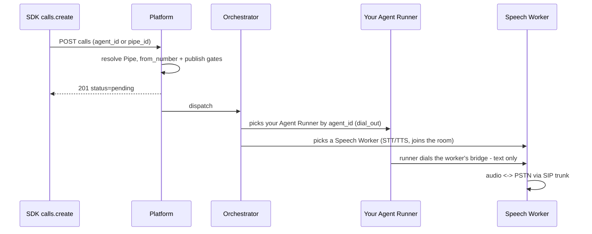

# Quickstart — first agent, first call

From install to a dispatched outbound call with the SDK surface as it exists
today. This doc is a transcription of a live verification run (2026-07-28)
against a locally started Unpod platform — the full transcript, including every
failure, is in [plans/2026-07-28-quickstart-run.md](plans/2026-07-28-quickstart-run.md).
Terms used throughout: a **Pipe** binds a voice profile to an `agent_id`; your
**Agent Runner** is the text-side process running your dialog logic; the
**Speech Worker** is Unpod's voice-side worker (STT/TTS — audio never reaches
your code); a **Playbook** is a SuperDialog artifact an Agent Runner executes.

## How this doc was verified

Every code block below either ran in the live verification run, or carries an
explicit *"verified against code, not yet run live"* marker. The run's
environment had no SIP trunk and no Speech Worker, so the final audio leg
(the actual PSTN dial) is static-only; everything up to and including the
orchestrator picking the Agent Runner ran live. The SDK's management wrappers
(`pipes.*`, `calls.*`) carry markers because of known gap #1 below — their
request bodies were executed live against the platform's own API instead, and
succeeded. The live run used `agent_id="docs-quickstart-run"` throughout; the
blocks below rename it `my-voice-agent` and change nothing else, so verbatim
outputs (worker JSON, ids) show the run's name.

## 0 — Install

```bash
pip install "unpod[dialog]"
```

*Verified against code (`pyproject.toml` — the `dialog` extra pulls
`superdialog`, used by the entrypoint below), not yet run live: the
verification run used an editable install.*

## 1 — Configure

```bash
export UNPOD_BASE_URL="https://api.unpod.ai"   # or your deployment's host
export UNPOD_API_KEY="sk_..."
```

`UNPOD_BASE_URL` is the single configuration knob: every endpoint the SDK
touches is derived from it in `_base_url.py` —

| Surface | Derived from `UNPOD_BASE_URL` |
|---|---|
| Management REST (`client.pipes`, `client.calls`, …) | `https://<host>/platform` |
| Orchestrator WebSocket (`AgentRunner`) | `wss://<host>` |
| Telephony / voice-profile plane (`client.telephony`, `client.voice_profiles`) | `https://<host>/api/v2/platform` |

Per-component overrides (`UNPOD_SERVICE_BASE_URL`, `UNPOD_ORCHESTRATOR_URL`,
`UNPOD_PLATFORM_BASE_URL`) still win when set — the verification run used them
to point every plane at `http://localhost:8000`.

> **Auth precedence warning.** If `UNPOD_PLATFORM_TOKEN` is set anywhere in
> your environment, it silently beats `UNPOD_API_KEY`: the client switches to
> token auth scoped by `UNPOD_ORG_HANDLE` and never sends your Bearer api key
> (`client.py::AsyncClient.__init__`). Seeing 401s with a valid api key?
> Check for a stray `UNPOD_PLATFORM_TOKEN` first. Note the SDK also calls
> `load_dotenv()` on import, so a `.env` file in your working directory counts.

## 2 — Create a Pipe

A Pipe binds a voice profile to an `agent_id` — the rendezvous key your Agent
Runner registers under. The real signature
(`management/pipes.py::PipesResource.create`):

```python
from unpod import AsyncClient

client = AsyncClient()
pipe = await client.pipes.create(
    name="my-voice-agent",
    voice_profile="Alloy",        # optional; a catalog *name*, resolved server-side
    agent_id="my-voice-agent",    # must match your AgentRunner's agent_id
    recording=False,
    max_call_duration_s=600,
)
print(pipe.pipe_id)               # PIPE_...
```

*Verified against code, not yet run live via the SDK (known gap #1). The
equivalent create body ran live against the platform's own API and returned
201 with the `agent_id` bound; the `"Alloy"` name-to-profile-id resolution was
live-verified on a pipe update in the same run (transcript, stage 3).*

The signature has one more optional parameter, not shown: `agent_endpoint`, a
static runner URL the platform falls back to when no live Agent Runner is
registered under the pipe's `agent_id` (supervoice
`telephony/inbound/handler.py::handle_inbound_join`). This quickstart does not
need it.

Notes, all observed live:

- There is **no** `system_prompt`, `first_message`, or `first_speaker`
  parameter. What the agent says lives in your entrypoint code (step 3), not
  in the Pipe.
- `voice_profile` is optional at create time and validated **by name** against
  the catalog; an unknown name fails with `voice_profile_not_found`.
- `client.voice_profiles.list(language="en")` reads the telephony plane, which
  is org-scoped: it needs `UNPOD_PLATFORM_TOKEN` auth and is unreachable with
  only a Bearer `UNPOD_API_KEY`.

## 3 — Run your Agent Runner

```python
from unpod import AgentRunner, CallContext

async def entrypoint(ctx: CallContext) -> None:
    from superdialog import LLMAgent

    ctx.session.dialog_machine = LLMAgent(
        llm="openai/gpt-4o-mini",
        system_prompt=(
            "You are a friendly voice assistant. "
            "Keep every reply under two sentences — your words are spoken aloud."
        ),
    )
    await ctx.session.say("Hello! How can I help you today?")
    await ctx.session.run()

AgentRunner(
    entrypoint=entrypoint,
    agent_id="my-voice-agent",    # same agent_id as the Pipe
    max_concurrent_calls=1,
).start()
```

**Ran live.** Registration observed on both sides; `GET /v1/workers` on the
platform returned:

```json
{"worker_id": "docs-quickstart-run#d4d4d4fd", "pool": "docs-quickstart-run",
 "max_concurrent": 1, "active_jobs": 0, "has_capacity": true,
 "agent_id": "docs-quickstart-run", "transport": "dial_out"}
```

(The entrypoint body itself did not execute in the run — no call reached the
runner because the media leg was rejected, see step 6. Its surface —
`ctx.session.dialog_machine`, `say`, `run` — is verified against
`connectivity/session.py::Session`.)

What the registration shows (`connectivity/runner.py::AgentRunner.__init__`):

- **Identity trio.** `agent_id` is the rendezvous key you choose; `worker_id`
  is `agent_id#<uuid8>`, one per runner process; `pool` equals `agent_id`.
- **No inbound port.** The default transport is `dial_out`: the runner dials
  out per call, so a laptop behind NAT needs zero network setup.
- **No `dev_mode`.** `dev_mode=True` only renames the pool to `agent_id@dev`
  — a separate pool that ordinary calls do not route to — and does nothing
  else (there is no hot reload). Leave it off.

## 4 — Attach a number

The primary flow is `client.telephony.numbers.attach` with your `agent_id`
(`telephony/__init__.py::NumbersResource.attach`):

```python
available = await client.telephony.numbers.list()   # status "not_assigned" = attachable
result = await client.telephony.numbers.attach(
    "+14155550101",               # one E.164 string, or a list of them
    agent_id="my-voice-agent",
)
r = result.numbers[0]
print(r.ok, r.connection_state, r.error)
```

*Verified against code, not yet run live — the telephony plane was outside the
verification run's scope.*

- This plane is org-scoped: it requires `UNPOD_PLATFORM_TOKEN` (plus
  `UNPOD_ORG_HANDLE`); it is not reachable in Bearer-api-key mode.
- Attach is partial-success: each number reports `ok`/`error` independently.
- If your numbers come from LiveKit SIP trunks on the management plane
  instead, `client.numbers.sync()` imports them — and returns a summary
  **dict**, not a list of numbers
  (`management/numbers.py::NumbersResource.sync`):

```python
summary = await client.numbers.sync()
print(summary)                    # {"synced": 12, "new": 2}
```

*Verified against code, not yet run live.*

## 5 — Make an outbound call

The `agent_id=` shortcut needs no `pipe_id` — the platform resolves the Pipe
bound to that agent server-side (`management/calls.py::CallsResource.create`):

```python
call = await client.calls.create(
    agent_id="my-voice-agent",
    to_number="+19995550001",
)
print(call.call_id, call.status)  # SCL_...  pending
```

*Verified against code, not yet run live via the SDK (known gap #1). Identical
request bodies — both the `agent_id=` and the `pipe_id=` form — ran live
against the platform's own API and returned 201 (transcript, stage 5).*

`status` starts as `"pending"`: creation enqueues the call and returns
immediately; dispatch happens asynchronously. Poll `calls.get(call_id)`.

Two gates were observed live before the 201, in order:

1. `no_from_number` — the Pipe had no attached number and no `from_number=`
   was passed. The run cleared it by passing `from_number=` explicitly.
2. `playbook_not_published` — outbound dispatch currently requires a
   **published Playbook** whose `agent_id` matches the Pipe's
   (supervoice `telephony/calls/service.py::create_call`). A live Agent
   Runner registered under that `agent_id` does not satisfy the gate on its
   own. Publish a Playbook whose slug equals your `agent_id`, then create the
   call. Known gap #2.

## 6 — What happens after the 201

Observed live (with the platform's queue in inline-dispatch mode):



In the verification run the orchestrator picked the live Agent Runner — the
`agent_id` rendezvous between Pipe, call, and runner works end to end. The
media leg then requires a Speech Worker and a SIP trunk on the platform side;
the dev environment had neither, so the session was rejected
(`no_worker_available`) and the audio leg of this quickstart is static-only.
Audio never crosses the runner: the Speech Worker owns STT/TTS, your runner
exchanges text.

## 7 — Monitor

```python
for c in await client.calls.list():
    print(c.call_id, c.status, c.from_number, "->", c.to_number)
```

*Verified against code, not yet run live via the SDK (known gap #1). The
equivalent platform query ran live and listed both dispatched calls of the
run with terminal status (transcript, stage 6).*

## Known gaps

Both were hit live in the verification run and are tracked for fixes; the
markers above exist because of them.

1. **SDK management paths vs. a directly served platform.** The management
   wrappers (`management/pipes.py`, `management/calls.py`,
   `management/voice_profiles.py`) target the hosted proxy's path scheme
   (`/api/v2/platform/...`). Against a locally started platform, which serves
   the same resources under `/platform/v1/...`, every pipes/calls/voice-profiles
   call 404s regardless of base URL. Until fixed, exercise those resources
   against the platform's own API when running locally (the transcript shows
   the exact requests).
2. **Outbound publish gate.** `calls.create` requires a published Playbook for
   the target `agent_id`; a registered Agent Runner alone is rejected with
   `playbook_not_published`.

## Next

- [00-overview.md](00-overview.md) — what Unpod owns vs. what you own.
- The full verification transcript:
  [plans/2026-07-28-quickstart-run.md](plans/2026-07-28-quickstart-run.md).
