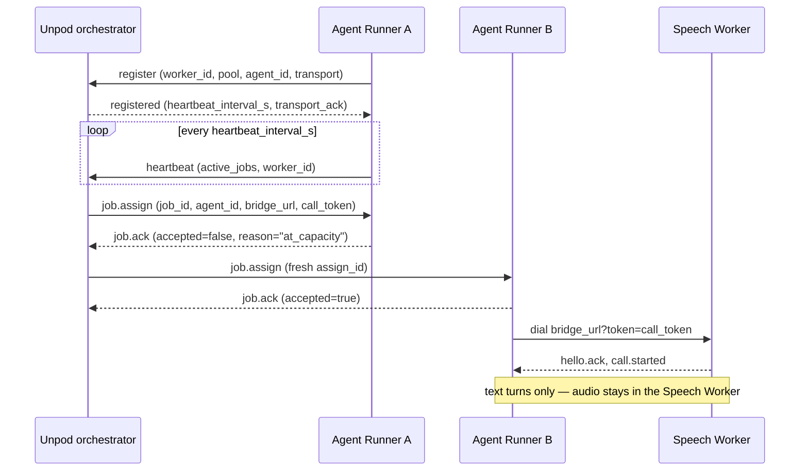

# Run your agent

Your dialog logic lives in a long-lived process — an **Agent Runner** — that
registers with Unpod under an `agent_id` and takes calls. This doc covers the
two places that process can run (your machine, or Unpod's infrastructure via
Publish), the three identifiers every runner carries, what happens when a
connection or a runner drops, and the four `call_end` reasons the SDK reports.
Every SDK claim below is verified against `src/unpod/connectivity/`; the few
platform-side claims are cited to supervoice symbols.

## Local runner vs Publish

If you have used Temporal or Prefect, the shape is familiar: the server is
someone else's problem and the worker is yours, running wherever you start it.
An Agent Runner is that worker. It holds one outbound WebSocket to Unpod's
orchestrator (`wss://<host>/v1/internal/workers`,
`connectivity/runner.py::AgentRunner`), work arrives over it, and each call is
a second outbound connection the runner dials. Nothing dials *in*, so a laptop
behind NAT needs no port forward, no tunnel and no public URL.

| | Local Agent Runner | Publish |
|---|---|---|
| Who starts the process | You: `AgentRunner(...).start()` | Unpod — but the binding that makes this automatic is not wired yet (below) |
| What it runs | Any Python — your entrypoint, any adapter, your own LLM keys | A published Playbook |
| SDK surface | `unpod.AgentRunner` | None today: `publish` appears nowhere under `src/unpod` |
| Where the code lives | Your machine or your server | Unpod's playbook-pool runners |
| Iteration loop | Restart the process | Re-publish the Playbook |
| Good for | Development, custom tools, private data, bring-your-own logic | Hosted operation with no process to babysit |

Publishing is a platform action, not an SDK call. `POST
/platform/v1/playbooks/{playbook_id}/publish` (supervoice
`platform/routers/playbooks.py::publish_playbook`) promotes the draft source,
derives an `agent_id` from the playbook slug, stamps it on both the playbook
and its Pipe, and — when a logged-in owner publishes — provisions the Pipe and
claims a number.

That handle routes a call only if an Agent Runner is already registered under
*exactly* that string — a slug-derived `agent_id` gets no playbook-pool
fallback (supervoice `orchestrator/brain_resolver.py::pool_agent_chain`: only
a `pool@…` handle expands to `[pool@{org}, unpod-playbook-pool]`). A pool
process registers under whatever `POOL_AGENT_ID` it is started with
(`playbook_pool/config.py`; supervoice's own `run-pool.sh` annotates the
variable "must equal `pipe.agent_id`"), and the production convention is the
pool form `pool@{org}` / `unpod-playbook-pool`
(`publish/service.py::pool_agent_id`). Putting `pool@{org}` on the Pipe is the
job of the publish saga (`publish/orchestrator.py::run_publish_saga`), which
today has no caller outside `publish/` — no production route reaches it. So a
publish produces the Pipe, the number and the handle, but *someone still has
to run a process registered under that handle*: treat hosted operation as the
intended end state, not as something publish alone delivers today. Supervoice
`docs/03-publish-and-runners.md` draws the same contrast between its §1.1
(route path, slug handle) and §1.2 (saga, `pool@{org}` handle).

Note that `enable_endpoint=True` is a *separate* door (the OpenAI-compatible
endpoint): a plain voice-agent publish never sets it, which is exactly the flag
outbound `calls.create` gates on — see
[01-quickstart.md § Known gaps](01-quickstart.md#known-gaps) (#2).

Either way the binding is the same and nothing references anything else
directly: a Pipe carries an `agent_id`, a number attaches to an `agent_id`, and
a runner registers under an `agent_id`. They rendezvous at call time.

## The identity trio

Three identifiers, all derived in `connectivity/runner.py::AgentRunner.__init__`
from the single `agent_id` you pass:

| Name | Value | Scope | Who chooses it |
|---|---|---|---|
| `agent_id` | `"my-voice-agent"` | The rendezvous key. Shared by the Pipe, the number attachment and every runner serving it | You |
| `worker_id` | `f"{agent_id}#{uuid.uuid4().hex[:8]}"` → `"my-voice-agent#d4d4d4fd"` | One per runner *process* | The SDK |
| `pool` | `agent_id`, or `f"{agent_id}@dev"` when `dev_mode=True` | The set the platform searches when routing a call | The SDK |

`worker_id` and `pool` both ride the `Register` frame
(`AgentRunner._build_register`); `worker_id` also rides every `Heartbeat` under
the default transport (`AgentRunner._heartbeat_loop`). The live registration in
[01-quickstart.md](01-quickstart.md) shows all three together.

Why they are separate:

- **`agent_id` is many-to-one on purpose.** Start five runners with the same
  `agent_id` and you have five candidates for every call; the platform picks
  the least loaded one with capacity (supervoice
  `orchestrator/worker_registry/redis_registry.py::RedisWorkerRegistry.pick_brain`).
  That is how you scale out and how failover works.
- **`worker_id` makes a reconnect idempotent.** It is minted once per process,
  so a control socket that drops and comes back re-registers under the same
  key; the registry keys workers by `worker_id`, so the entry is replaced, not
  duplicated (`RedisWorkerRegistry.register`).
- **`pool` is the search scope.** Call routing looks up
  `pick_brain(agent_id, pool=agent_id)` (supervoice
  `orchestrator/brain_assign.py::pick_brain_decision`), so for ordinary calls
  the pool must equal the `agent_id`. That equality is the whole reason
  `dev_mode` behaves the way it does.

## `dev_mode` does one thing

`AgentRunner(dev_mode=True)` changes exactly one value: the pool becomes
`f"{agent_id}@dev"`. The flag is stored on `self._dev_mode` and never read
again — the only other reference in `src/unpod` is the constructor parameter
itself.

There is **no hot reload.** No file watching, no module reloading, no
code-change detection exists anywhere in this package. Editing your entrypoint
requires restarting the process, with or without the flag.

And because routing searches `pool == agent_id`, a runner in `agent_id@dev` is
invisible to ordinary calls: your Pipe points at `my-voice-agent`, your runner
sits in `my-voice-agent@dev`, and the two never meet. Unless you are
deliberately driving traffic at the `@dev` pool, leave `dev_mode` off — the
default.

## Reconnection and failover

Two independent connections, with independent failure behaviour: one long-lived
control socket, plus one bridge connection per call.



**The control socket.** `AgentRunner.run` reconnects on any control-socket
failure with jittered exponential backoff and re-registers with the same
`worker_id` (`AgentRunner._next_backoff`: 1s doubling to a 30s ceiling, ±50%
jitter, ceiling applied after jitter; the ladder resets on a successful
connect). A registration failure never kills the process. The one exception is
deliberate: if the orchestrator does not acknowledge the `dial_out` transport
it raises `_TransportRejected` out of `run()` rather than retrying, because
reconnecting would only reach the same too-old orchestrator.

**Assignment is two-phase.** `job.assign` → `job.ack`. The runner rejects with
`reason="agent_id_mismatch"` when the assignment is not for its `agent_id`, and
`reason="at_capacity"` when it already holds `max_concurrent_calls` jobs —
counting jobs that are accepted-but-still-dialing, not just live calls
(`AgentRunner._handle_assign`). `max_concurrent_calls` overrides `max_sessions`
when both are passed, and is what the runner advertises to the platform.

**Failover is the platform's job.** On a reject or no ack within 2s the
orchestrator releases the reservation and re-picks a different runner, up to 3
assign attempts in total, each with a fresh `assign_id` so a late ack from a
timed-out attempt cannot resolve the current one (supervoice
`orchestrator/brain_assign.py::send_assign`). This only works if more than one
runner is registered under the `agent_id` — a single runner is a single point
of failure.

**Dialling the call.** Once accepted, the runner dials the Speech Worker's
bridge with up to 3 attempts and a short backoff (0.2s, 0.4s)
(`AgentRunner._dial_for_job`). The retry is *aimed* at the pre-handshake
window — a transient network error, or a pairing the worker registers a beat
after the ack — but it wraps the whole `dial_bridge(...)` call, and
`connectivity/bridge_server.py::handle_bridge_connection` re-raises after
stamping `final_state="failed"`. So a **mid-call** raise out of your entrypoint
is retried too: the runner redials the same `bridge_url` and `call_token` (the
worker-side pairing stays valid for the job lifetime), and your entrypoint can
therefore run up to three times for one call. Write it to be safe to re-enter,
or catch your own exceptions. A `job.cancel` frame cancels the job task
whether it is dialling or in-call.

**In-flight calls survive control drops.** Each call rides its own bridge
socket, so losing the orchestrator connection does not end conversations
already in progress; only new assignments stop arriving until the control
socket is back. There is no automatic mid-call redial — see Known gaps.

**Liveness.** The orchestrator advertises the heartbeat interval in its
`registered` frame (10s from supervoice
`orchestrator/worker_registry/dispatch.py::WorkerDispatchServer`), and the
registry entry carries a TTL refreshed on register and on each heartbeat;
expiry *is* the eviction (30s default,
`RedisWorkerRegistry`). A runner that dies without deregistering therefore
disappears from routing on its own.

| Behaviour | Value | Owner | Symbol |
|---|---|---|---|
| Control reconnect backoff | 1s → 30s, ±50% jitter | SDK | `AgentRunner._next_backoff` |
| Bridge dial retries | 3 attempts, 0.2s/0.4s apart | SDK | `AgentRunner._dial_for_job` |
| Bridge connect timeout | 5s | SDK | `connectivity/bridge_dialer.py::dial_bridge` |
| Bridge handshake timeout | 10s | SDK | `connectivity/bridge_server.py::handle_bridge_connection` |
| Assign ack timeout | 2s | Platform | `orchestrator/brain_assign.py` |
| Assign attempts per call | 3 | Platform | `orchestrator/brain_assign.py::send_assign` |
| Heartbeat interval | 10s (advertised) | Platform | `orchestrator/worker_registry/dispatch.py` |
| Registry TTL | 30s | Platform | `orchestrator/worker_registry/redis_registry.py` |

**Transport.** `dial_out` is the default and the model above. `transport="serve"`
is the deprecated legacy model where the runner listens and the Speech Worker
dials in (teardown scheduled); passing `serving_url` or `agent_secret` under
`dial_out` raises a `DeprecationWarning` because the runner never listens
(`AgentRunner.__init__`).

**Shutdown.** `await runner.shutdown()` sets `_shutting_down` (which ends the
heartbeat loop at the top of its next interval) and then sleeps the full
`drain_timeout_s` (default 60) if any call is in flight — it does not poll for
drain, so a 2-second call still blocks the caller for the whole 60s, and it
does not cancel job tasks. See Known gaps for the rest.

## What `call_end` tells you

`call_end` fires from **two different hook registries** with **two different
vocabularies**, and both fire for the same call. Register on the runner
(`runner.on("call_end")`) for accounting; register on the session
(`ctx.session.on("call_end")`) for why the conversation stopped.

| Value | Hook on | Handler args | Fired by | Means |
|---|---|---|---|---|
| `"hangup"` | Session | `(reason)` | `connectivity/session.py::Session.run` | The event loop ended without an error event: the caller hung up, the bridge went away, or the agent ended the call itself |
| `"error"` | Session | `(reason)` | `connectivity/session.py::Session.run` | An `error` event arrived from the bridge or pipeline; the loop broke on it |
| `"ended"` | Runner | `(ctx, final_state)` | `connectivity/runner.py::AgentRunner._track_call_end` | Your entrypoint returned normally; counted as completed |
| `"failed"` | Runner | `(ctx, final_state)` | `connectivity/runner.py::AgentRunner._track_call_end` | Your entrypoint raised; counted as failed |

Three consequences worth internalising:

- **The session pair is not an error/success split.** `"hangup"` means "no
  `error` event", nothing more — a call the agent deliberately ended with
  `session.end("completed")` reports `"hangup"`.
- **The runner pair is about your code, not the call.** `"failed"` means the
  entrypoint raised, which is why an entrypoint that swallows its own
  exceptions will always report `"ended"`. It also fires **once per entrypoint
  run, not once per call**: because a raise triggers a redial (see *Dialling
  the call*), one call whose entrypoint keeps raising fires `"failed"` up to
  three times.
- **Ordering.** The session hook fires inside `Session.run()`, the runner hook
  after the entrypoint returns — so a normal call reports `"hangup"` then
  `"ended"`. A session hook only fires at all if your entrypoint calls
  `await ctx.session.run()`.

```python
from unpod import AgentRunner, CallContext

async def entrypoint(ctx: CallContext) -> None:
    @ctx.session.on("call_end")
    async def on_session_end(reason: str) -> None:
        print(f"{ctx.session_id} stopped because: {reason}")   # hangup | error

    await ctx.session.run()

runner = AgentRunner(entrypoint=entrypoint, agent_id="my-voice-agent")

@runner.on("call_end")
async def on_runner_end(ctx: CallContext, final_state: str) -> None:
    print(f"{ctx.session_id} finished: {final_state}")         # ended | failed

runner.start()
```

*Verified against code, not run live: `HookRegistry.fire` passes the arguments
shown, and both `fire("call_end", ...)` call sites are the two named in the
table.*

`runner.stats()` complements the hooks with a live snapshot — `in_flight`,
`completed_last_hour`, `failed_last_hour`, `capacity`,
`mean_call_duration_s` — accumulated by the same `_track_call_end`. Read the
counters with the redial caveat above in mind: `mean_call_duration_s` sums the
connected duration of *every* call, failed ones included, but divides by
`completed_last_hour` only, so retried failures pull it upward.

## Known gaps

Verified dead or incomplete surface, so you do not build on it:

| Gap | Detail |
|---|---|
| `permits_per_minute` | Constructor parameter stored on `self._permits_per_minute` and never read. Not a rate limit; sets nothing |
| `RunnerStats.queued` | Hardcoded `0` in `AgentRunner.stats`. Never reflects queued work |
| `shutdown()` | Sets `_shutting_down`, then sleeps the whole `drain_timeout_s` if any call is in flight: no drain polling, no job-task cancellation, and `_control_recv_loop` stays blocked in `ws.recv()`. It also does not close the legacy `serve`-mode listening socket — its own `TODO` |
| Retry-inflated counters | A raising entrypoint is redialled up to 3× for one call, so `call_end("failed")` and `failed_last_hour` count entrypoint failures, not calls, and `mean_call_duration_s` divides every call's duration by the *completed* count alone (`AgentRunner._track_call_end`, `AgentRunner.stats`) |
| Mid-call redial | A dropped bridge mid-call is not redialled. `Session.run` swallows a transport drop as a normal end, so the dialer cannot tell a drop from a hangup; the worker-side pairing stays valid for the job lifetime so a future redial can work (`AgentRunner._dial_for_job` docstring) |

## Roadmap

> **Status: roadmap — not built.**

- **Publish from the SDK.** Publishing is a platform action today; nothing under
  `src/unpod` exposes it.
- **Docker-per-agent publish.** Publish currently means playbook-pool
  processes; per-agent containers are planned.
- **`serve` transport teardown.** The legacy transport is deprecated with
  removal scheduled; `dial_out` is the only model that will remain.

## Next

- [01-quickstart.md](01-quickstart.md) — the runner in context: Pipe, number,
  first call.
- [03-connectivity-sdk.md](03-connectivity-sdk.md) — the full `AgentRunner` and
  `Session` surface. **Pending revamp:** it documents hooks nothing fires; take
  hook behaviour from this doc and from the `fire()` calls in
  `connectivity/session.py`.
- [04-adapters.md](04-adapters.md) — what the agent says once a call lands.
- [00-overview.md](00-overview.md) — what Unpod owns vs. what you own, and the
  terminology canon.
