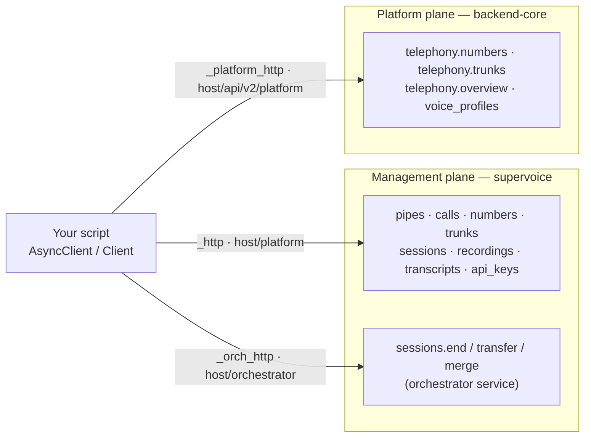

# Management SDK — REST reference

`AsyncClient` / `Client` are the REST side of the SDK: everything you configure
*before* a call — Pipes, phone numbers, voice profiles, outbound calls, sessions,
recordings, transcripts, API keys. The surface spans **two independent planes**
(the supervoice management plane and the backend-core platform plane), and the
one decision that matters most is which of the **two number surfaces** you use:
the answer is `client.telephony.numbers.attach`. The runtime half of the SDK —
`AgentRunner`, the per-call `Session`, hooks — is a different package and lives
in [04-connectivity-sdk.md](04-connectivity-sdk.md).

Read the docs in the order *00 overview → 01 quickstart → 02 run-your-agent →
03 management (this doc) → connectivity → adapters*; the filenames on disk are
authoritative and every link here resolves.

## Planes and clients

Everything below hangs off `client.py::AsyncClient.__init__`, which builds three
HTTP clients and hands all of them the same `Auth` strategy. Three clients, two
planes: the orchestrator is a third *base URL* on the management plane, not a
plane of its own — its base is the management base with a trailing `/platform`
swapped for `/orchestrator`, and it carries the same auth.



| Namespace | HTTP client | Plane | Auth it accepts |
|---|---|---|---|
| `pipes`, `calls`, `numbers`, `trunks`, `sessions`, `recordings`, `transcripts`, `api_keys` | `_http` | Management (supervoice) | `Bearer` api key direct, or DRF token / JWT through the backend-core speech proxy |
| `sessions.end` / `.transfer` / `.merge` | `_orch_http` | Management (supervoice), orchestrator base | same strategy as above |
| `telephony.*`, `voice_profiles` | `_platform_http` | Platform (backend-core) | DRF token or JWT only — **never** a Bearer api key |

One `Auth` serves all three clients, so a single client object cannot be in
Bearer mode for the management plane *and* token mode for the telephony plane.
Build two clients when you need both.

`Client` is a blocking facade over `AsyncClient` (`client.py::_SyncResource`);
it raises `RuntimeError` when called from inside a running event loop
(`client.py::_run_blocking`). Every example below is async.

## Auth

Three strategies, all exported from the package root (`unpod/__init__.py`) and
all defined in `management/_auth.py`:

| Strategy | Header(s) it sends | Reaches |
|---|---|---|
| `BearerAuth(api_key)` | `Authorization: Bearer <key>` | supervoice directly — its dependency is `HTTPBearer` (`platform/auth.py::get_auth_context`), so any other scheme is refused |
| `TokenAuth(token, org_handle=None)` | `Authorization: Token <token>`, plus `Org-Handle` when set | backend-core DRF `TokenAuthentication` — the platform plane and the speech proxy |
| `JWTAuth(token, org_handle=None)` | `Authorization: JWT <token>`, plus `Org-Handle` when set | the same backend-core surfaces, with a platform user JWT |

### Precedence — read this before debugging a 401

`client.py::AsyncClient.__init__` picks a strategy in this order:

1. an explicit `auth=` argument;
2. **`UNPOD_PLATFORM_TOKEN`** → `TokenAuth(token, org_handle=UNPOD_ORG_HANDLE)`;
3. the `api_key=` argument, else `UNPOD_API_KEY` → `BearerAuth(api_key)`;
4. otherwise `ValueError`.

Step 2 sits *above* the `api_key=` argument: with `UNPOD_PLATFORM_TOKEN` set in
the environment, `AsyncClient(api_key="sk_...")` still sends `Authorization:
Token …` and your api key is never used. The SDK also calls `load_dotenv()` at
import time (`client.py`), so a `.env` file in the working directory counts as
"set". Getting this wrong shows up in one of two ways:

- token auth against direct supervoice — `HTTPBearer` refuses the request;
- Bearer auth against `client.telephony.*` or `client.voice_profiles` — DRF
  refuses it, because those views authenticate with `TokenAuthentication` /
  `UnpodJSONWebTokenAuthentication` only.

`Org-Handle` is attached only when the strategy is given an `org_handle`. The
telephony endpoints require it (their permission set includes `IsOrgMember`);
the voice-profile endpoints require an authenticated token but no org handle.

## Configuration

| Variable | Effect |
|---|---|
| `UNPOD_BASE_URL` | The single knob every base is *derived* from — `https://<host>/platform` (`_base_url.py::service_base`) and `https://<host>/api/v2/platform` (`_base_url.py::platform_base`) |
| `UNPOD_SERVICE_BASE_URL` | Overrides the management base |
| `UNPOD_PLATFORM_BASE_URL` | Overrides the platform (telephony / voice-profile) base — there is no constructor argument for this one |
| `UNPOD_ORCHESTRATOR_BASE_URL` | Overrides the base used by `sessions.end` / `.transfer` / `.merge` |
| `UNPOD_API_KEY` | Bearer api key (also read by `AgentRunner`) |
| `UNPOD_PLATFORM_TOKEN` | DRF token; **wins over** `UNPOD_API_KEY` |
| `UNPOD_ORG_HANDLE` | The `Org-Handle` sent alongside the token |

`UNPOD_ORCHESTRATOR_URL` is a different variable and belongs to the Agent
Runner's WebSocket connection (`connectivity/runner.py`), not to this client.

Resolution order per client, all in `client.py::AsyncClient.__init__`:

| Client | Order |
|---|---|
| Management (`_http`) | `base_url=` → `UNPOD_SERVICE_BASE_URL` → `service_base()` → `https://api.unpod.ai/platform` |
| Orchestrator (`_orch_http`) | `orchestrator_base_url=` → `UNPOD_ORCHESTRATOR_BASE_URL` → the management base with a trailing `/platform` swapped for `/orchestrator` → the management base unchanged |
| Platform (`_platform_http`) | `UNPOD_PLATFORM_BASE_URL` → `platform_base()` → the management base with a trailing `/platform` swapped for `/api/v2/platform` → the management base unchanged |

> **No single base URL serves every management resource today.** `pipes`,
> `calls` and `numbers` spell an `/api/v2/platform/...` prefix inside their own
> request paths, while `sessions`, `recordings`, `transcripts`, `api_keys` and
> `trunks` request bare `/v1/...` — and all of them run on the same `_http`
> client. Whichever value you pick, one half misses. The workaround the verified
> quickstart run used, and what a real fix requires, are in
> [01-quickstart.md § Known gaps](01-quickstart.md#known-gaps) (#1). The SDK's
> own tests still assert the pre-migration paths
> (`tests/test_management.py::test_numbers_list` expects `/v1/numbers`), which is
> the same drift seen from the other side.

## Numbers — two surfaces, one verdict

**Use `client.telephony.numbers.attach`.** Its module docstring
(`telephony/__init__.py`) calls attaching a number to an agent "the PRIMARY
flow"; it is the surface backed by live routes on both sides; and it is the one
that takes an `agent_id` — the same rendezvous key your Agent Runner registers
under, though on the default termination the platform additionally demands a
platform agent carrying that handle (the precondition below).

| | `client.telephony.numbers` (plane B) | `client.numbers` (plane A) |
|---|---|---|
| Module | `telephony/__init__.py::NumbersResource` | `management/numbers.py::NumbersResource` |
| Base | `https://<host>/api/v2/platform` | `https://<host>/platform` |
| Identifier | E.164 number (`"+14155550101"`) | opaque `number_id` (`NUM_…`) |
| Binds to | an `agent_id` (default) or a `pipe_id` | a `pipe_id` |
| Auth | DRF token / JWT plus `Org-Handle` | Bearer api key direct, or token via the proxy |
| Verdict | **Primary** | Legacy — three of its six methods aim at routes that do not exist (below) |

### `telephony.numbers.attach` — the primary flow

```python
available = await client.telephony.numbers.list()   # status "not_assigned" = attachable
result = await client.telephony.numbers.attach(
    "+14155550101",                # one E.164 string, or a sequence of them
    agent_id="my-voice-agent",
)
r = result.numbers[0]
print(r.ok, r.connection_state, r.error)
```

> **Precondition: that example only works if a platform agent whose handle is
> `my-voice-agent` is owned by your org.** With the default
> `attach_type="agent"`, backend-core gates the whole request on agent ownership
> *before it touches any number* —
> `views_telephony.py::TelephonyNumbersViewSet.attach` runs
> `Pilot.objects.filter(handle=agent_id, owner=org).exists()` and, on a miss,
> answers HTTP 400 with a body of `{"agent_id": …, "numbers": [], "message":
> "Agent not found for this organization."}`. It is an anti-IDOR gate: the agent
> path resolves the Pilot by handle alone, and handles are not globally unique,
> so an ungated attach could bind a number to — and mutate the telephony config
> of — another org's agent. A `pipes.create(agent_id=…)` Pipe or a running Agent
> Runner does **not** satisfy it: a Pilot is a platform-side record, created
> through the dashboard/platform API, not by this SDK.

**The escape hatch: `attach_type="pipeline"`.** That termination is deliberately
exempt from the Pilot gate — the gate's own condition is `agent_id and
attach_type != "pipeline"` — because the pipeline path never resolves a Pilot at
all: `telephony/services/attach.py::_attach_pipeline` creates the LiveKit trunks,
rebuilds the dispatch rule, and forwards `agent_id` to supervoice as an opaque
string, matched there against your own project-scoped pipes. Gating it would
force every supervoice agent to keep a Django twin. It costs one extra argument:
`pipe_id` is required, and the serializer rejects the request up front without it
(`serializers.py::AttachAgentToNumbersSerializer.validate`):

```python
result = await client.telephony.numbers.attach(
    "+14155550101",
    agent_id="my-voice-agent",       # opaque here — no Pilot row needed
    attach_type="pipeline",
    pipe_id=pipe.pipe_id,            # required on this path
)
```

Full signature (`telephony/__init__.py::NumbersResource.attach`) — everything
after `numbers` is keyword-only:

| Parameter | Type | Meaning |
|---|---|---|
| `numbers` | `str \| Sequence[str]` | One E.164 number or several. A bare `str` counts as one number, never iterated character by character (`telephony/__init__.py::_as_number_list`) |
| `agent_id` | `str \| None` | The agent the number routes to. Optional — omitting it wires the number for agent use without binding one yet, and skips the ownership gate entirely (the gate reads `if agent_id and attach_type != "pipeline"`). **When set on the default termination it must be the handle of a platform agent your org owns**, or the request 400s with `"Agent not found for this organization."` (precondition above) |
| `attach_type` | `"agent" \| "pipeline"` | Termination path. The SDK omits the key when unset and the platform defaults it to `"agent"`. `"pipeline"` is the Pilot-gate-exempt path — `agent_id` travels to supervoice as an opaque string |
| `pipe_id` | `str \| None` | **Required when `attach_type="pipeline"`** — the supervoice pipe the number routes to |
| `bridge_slug` | `str \| None` | Advanced: target a specific voice bridge instead of the org's resolved one |
| `region` | `str \| None` | Advanced: region for a newly created bridge |

Behaviour worth knowing:

- **E.164 validation lives on the platform**, so the SDK cannot drift from it.
- **Partial success.** The response is an `AgentAttachResult` whose `numbers`
  list carries one `NumberResult` per input, each with its own `ok` / `error`.
  The platform answers 201 when at least one number attached, 400 when none did.
- **`connection_state`** on each result is the SBC link lifecycle, echoed from
  the platform as the stored enum name: `NOT_LINKED`, `PENDING_VERIFY`, `LINKED`
  or `ERROR`.
- **`detach(numbers)`** is the inverse and needs only the numbers — termination,
  agent and pipe are read from the stored record. It *releases* the supervoice
  number record rather than deleting it, so the number stays available for a
  later attach.
- **`overview()`** on the namespace
  (`telephony/__init__.py::TelephonyNamespace.overview`) returns per-number
  lifecycle plus cross-plane sync state: `bridge_slug`, `connection_state`,
  `termination_kind`, `agent_id`, `provider`, `sync_state`, `in_sync`.

`list()` sends `include_assigned=true`, so you see your org's attached numbers
as well as the claimable pool; another org's assigned numbers are never returned
either way.

### Status vocabularies differ per plane

Same field name, two vocabularies — check which resource produced the object
before comparing its `status`.

| Plane | Values | Where they come from |
|---|---|---|
| `client.telephony.numbers` → `telephony/__init__.py::Number` | `not_assigned`, `assigned`, `closed` | Derived by `Number._derive_status` from the platform's `state` plus `active`, so `not_assigned` **always** means attachable: an unassigned-but-inactive number reports `closed` |
| `client.numbers` → `models/number.py::Number` | `available`, `assigned`, `in_call`, `disabled` | supervoice's `NumberStatus`. The field also accepts a raw `state` key (`AliasChoices("status", "state")`), so a platform response carrying `NOT_ASSIGNED` lands in `status` verbatim |

### `client.numbers` — what still works

The verdict column judges the request **path** against the routes that exist;
whether it lands also depends on the base URL composing correctly (the callout
above).

| Method | Path it sends | Live route? |
|---|---|---|
| `sync()` | `POST /api/v2/platform/speech/v1/numbers/sync` | Yes — the backend-core speech proxy forwards it to supervoice `platform/routers/numbers.py::sync_numbers` |
| `detach(number_id)` | `DELETE /api/v2/platform/speech/v1/numbers/{id}/attach` | Yes — same proxy, `platform/routers/numbers.py::detach_number` |
| `list(...)` | `GET /api/v2/platform/telephony/numbers/` | Reaches the **platform** pool listing, not supervoice's. Rows are `{id, number, active, state}`, which is why `status` reads `NOT_ASSIGNED` |
| `attach(number_id, pipe_id, agent_id=)` | `POST /api/v2/platform/telephony/numbers/{id}/attach-numbers/` | **No route matches.** The platform's attach is `telephony/numbers/attach/` (no id in the path); `attach-numbers/` belongs to trunks |
| `delete(number_id)` | `DELETE /api/v2/platform/telephony/numbers/{id}` | **No route matches** on that plane |
| `release(number_id)` | identical to `delete` | Same endpoint, two method names (`management/numbers.py::NumbersResource.release`) — neither is live |

`sync()` returns a **summary dict, not a list of numbers**:

```python
summary = await client.numbers.sync()
print(summary)                    # {"synced": 12, "new": 2}
```

Those keys are supervoice's own return value
(`platform/routers/numbers.py::sync_numbers`): `synced` counts every number
found on the LiveKit inbound trunks, `new` counts the ones inserted this run.
Existing numbers are never downgraded.

The pipe-attach that *is* live — what `client.numbers.attach` aims at — is
`POST /v1/numbers/{id}/attach` with a body of `{"pipe_id": …, "agent_id": …}`
(`platform/routers/numbers.py::attach_number`). It answers `409 number_in_use`
when the number is mid-call and `409 number_already_assigned` when another
binding won the race. Detaching on this plane *deletes* the supervoice number
document, where the plane-B detach releases it.

## Voice profiles

Read-only catalog of STT + TTS bundles. **This resource moved planes**: it reads
backend-core's `/voice-profiles/` on `_platform_http`
(`management/voice_profiles.py`), not supervoice. Three consequences:

- it needs `UNPOD_PLATFORM_TOKEN` (or an explicit `TokenAuth` / `JWTAuth`); a
  Bearer `UNPOD_API_KEY` is refused;
- it does *not* need `Org-Handle` — that view's permission set is
  `IsAuthenticated` alone, unlike telephony's;
- its body is double-wrapped (the view returns `{"data": …}` and the platform
  renderer wraps that again), which the resource unwraps twice for you.

```python
profiles = await client.voice_profiles.list()
profile = await client.voice_profiles.get("VP_openai_alloy")
```

`list(language="hi")` accepts and sends the parameter
(`management/voice_profiles.py::VoiceProfilesResource.list` puts it in the query
string), but **the server does not honor it today**: the backing view
(`views.py::VoiceProfilesV2ViewSet.get`) reads no query params and returns every
`status=active` profile. The filter silently no-ops, so filter by `language` on
the client side.

Only `list` and `get` exist; profiles are managed upstream. When creating a Pipe
you may pass either `profile.name` or `profile.profile_id` — supervoice resolves
both (`platform/routers/pipes.py::_resolve_voice_profile`). Prefer the
`profile_id`: names are editable, and the seeded catalog has already renamed one
(`VP_openai_alloy` is `"Ankit"` in
`platform/seed/voice_profiles.py::GLOBAL_PROFILES`, not `"Alloy"`), which turns
a hard-coded name into a 422 `voice_profile_not_found`.

## Domain dictionaries — the words an agent hears and says

`client.domain_dictionaries` (`management/domain_dictionaries.py`, supervoice
`/v1/domain-dictionaries`). One dictionary per *domain*, reused by every agent
tagged with that domain. Three sections:

| Section | Feeds | `key` | `value` |
|---|---|---|---|
| `vocabulary` | STT keyterms | the term | an optional misheard variant |
| `pronunciation` | TTS | the term | its respelling |
| `fillers` | what the agent says while thinking | language code (`en`, `hi`) | phrases, one per line |

**Two steps, and both are load-bearing.** The dictionary is one object; the
agent's `domain` tag is another. Nothing looks a dictionary up by name at call
time — the runtime reads the tag off the agent row
(`supervoice/composition.py::_domain_of`) and loads the dictionary it names.
A dictionary with nothing tagged changes no call.

```python
# 1. author it (REPLACES this tenant's rows for the domain — not a merge)
await client.domain_dictionaries.upsert(
    "gamestop",
    vocabulary={"PowerUp Rewards": "power up rewords", "Xbox Series X": ""},
    pronunciation={"GameStop": "GAME-stop"},
    fillers={"en": "One moment…\nLet me check that…"},
)

# 2. tag the agent — this is what makes a call use it
await client.agents.voice.create(
    "gamestop-support", brain=Prompt("You are…"), domain="gamestop"
)
# or retag a live agent; reaches every voice of the group
await client.agents.update("gamestop-support", domain="gamestop")
```

`upsert` accepts a mapping (shown above), a list of `{"key":…, "value":…}` rows,
or a list of `models.KVItem` — so a fetched dictionary round-trips unedited.
Since it REPLACES the tenant layer, add a single term by reading first:

```python
doc = await client.domain_dictionaries.get("gamestop")
rows = [{"key": i.key, "value": i.value} for i in doc.vocabulary]
rows.append({"key": "Pro Day", "value": ""})
await client.domain_dictionaries.upsert("gamestop", vocabulary=rows)
```

**Three bundled seeds need no rows at all**: `banking`, `real_estate`,
`hospital`. Tagging an agent `domain="banking"` works with an empty project —
the seed resolves server-side, and your `upsert` rows layer on top (tenant wins
per key). A *custom* domain with no rows and no seed resolves to nothing, so the
tag applies no keyterms and no fillers; that is the one silent failure here, and
`get()` returning empty `vocabulary`/`fillers` is how you see it.

Reads are MERGED (seed ∪ tenant) — `vocabulary` is what the runtime will use,
`seed_vocabulary` is the bundled half read-only, so you can tell what you
inherited from what you typed. `DomainDictionary.keyterms` computes the exact
keyterm list the recognizer receives (key AND variant, deduped).

```python
for row in await client.domain_dictionaries.list():
    print(row.domain, "seeded" if row.seeded else "custom", row.agent_ids)

await client.domain_dictionaries.clone("banking", "acme-banking")  # 409 if it has rows
await client.domain_dictionaries.delete("gamestop")
```

`delete` means two different things by design: a **seeded** domain is *reset*
(your overrides drop, the seed and the tags remain), a **custom** domain ceases
to exist (agents and voice profiles pointing at it are untagged).

`attach` / `detach` write only the `agent_ids` reverse index — what the
Dictionaries pane lists. They do **not** change which dictionary an agent
speaks with; that is the `domain=` tag. Creating an agent with `domain=` writes
both (`platform/routers/agents.py::_sync_dictionary_index`), so you rarely call
them directly. One dictionary per agent is enforced: attaching pulls the agent
out of every other domain.

The older `client.agent.voice.create(...)` surface takes `domain=` too, and for
a playbook brain stamps it on the playbook document as well, so the authoring UI
shows the same tag.

## Background sound — the room a caller hears behind the agent

Ambience is mixed into the agent's outgoing audio for the whole call. Three
independent knobs, and conflating any two of them is the mistake worth avoiding:

| Argument | Says | Unset means |
|---|---|---|
| `background_sound` | WHICH room — `office`, `city`, `forest`, `crowded_room`, `none` | no bed (ambience is opt-in on the track) |
| `background_sound_enabled` | WHETHER any bed plays | on |
| `background_sound_volume` | HOW LOUD — a **gain** in `0.0`–`1.0`, not a percentage | the platform's own level (currently `0.3`), never silence |

```python
from unpod import BackgroundSound, Client, Prompt

client = Client()

client.agents.voice.create(
    "gamestop-support",
    brain=Prompt("You are…"),
    voice_profile="hindi-female-warm-hd",
    background_sound=BackgroundSound.office,
    background_sound_volume=0.45,
)

# Level alone; the room is untouched.
client.agents.update("gamestop-support", background_sound_volume=0.15)

# Off for now — the room is REMEMBERED, so switching back on picks it up again.
client.agents.update("gamestop-support", background_sound_enabled=False)
```

`background_sound_volume=0.0` is a **silent bed**, not the off switch — use
`background_sound_enabled=False` for that, and it keeps the chosen room. A level
outside the range raises `ValueError` at the call site rather than on the round
trip, because the mistake it catches (`30`, meaning "30%") would otherwise play
at full level.

Fixed for the call, by design: the agent cannot turn its own ambience up
mid-sentence, and nothing about the bed is reachable by the LLM or the caller.
Both creation surfaces take all three arguments — `client.agents.voice.create`
(`/v1/agents`) and `client.agent.voice.create` (`/v1/agent/voice`) — as does the
deprecated `client.pipes.create`. `client.pipes.update(pipe_id, **kwargs)`
forwards them too.

Requires supervoice with the ambience-volume field. Against an older
deployment, `/v1/agent/voice` answers **422** for these keys and
`/v1/pipes` PATCH ignores them silently.

## Pipes

A Pipe binds a voice profile to an `agent_id`. The real signature
(`management/pipes.py::PipesResource.create`):

```python
pipe = await client.pipes.create(
    name="my-voice-agent",
    voice_profile="VP_openai_alloy",  # optional; profile_id or catalog name
    agent_id="my-voice-agent",      # must match your AgentRunner's agent_id
    agent_endpoint=None,            # optional static fallback URL (legacy serve transport)
    recording=False,
    max_call_duration_s=3600,
)
```

There is no `system_prompt`, `first_message` or `first_speaker` parameter — what
the agent says lives in your entrypoint code. `update` is a PATCH taking
arbitrary keyword arguments (`PipesResource.update(pipe_id, **kwargs)`); PATCH is
supervoice's only pipe-update verb. `get`, `list` and `delete` complete the set.

## Calls

```python
call = await client.calls.create(
    agent_id="my-voice-agent",      # takes priority over pipe_id
    to_number="+19995550001",
    from_number="+14155550101",
    instructions="Customer prefers Hindi.",
    data={"customer_id": "C123"},
)
print(call.call_id, call.status)    # SCL_…  pending
```

`management/calls.py::CallsResource.create` resolves its arguments like this:

| Argument | Rule |
|---|---|
| `agent_id` / `agent` | `resolved_agent = agent_id or agent` — `agent=` is an alias kept for older callers |
| `pipe_id` | Optional. Given `agent_id`, the platform resolves the Pipe bound to that agent server-side; both keys are sent when both are supplied |
| `to_number` / `user_number` | `to_number or user_number` — `user_number=` is the alias |
| `from_number`, `instructions`, `data` | Sent only when not `None` |

Creation is asynchronous: the platform enqueues the call and the returned `Call`
reflects the queued state, not completion — poll `calls.get(call_id)`.
`calls.list(status=, pipe_id=)` filters (`status` goes out as `call_status`), and
`calls.hangup(call_id)` ends a live one, synthesising
`Call(status="hangup_requested")` when the platform answers with an empty body.

Outbound dispatch also passes a publish gate on the platform side that a
registered Agent Runner alone does not satisfy — see
[01-quickstart.md § Known gaps](01-quickstart.md#known-gaps) (#2).

## Sessions — and the three things called `Session`

The name collides three ways. They are unrelated types, and only the first is a
live object.

| Type | Import | What it is |
|---|---|---|
| `Session` (runtime) | `from unpod import Session` → `connectivity/session.py::Session` | The per-call object your entrypoint drives: `say`, `run`, `transfer`, hooks, `dialog_machine`. Documented in [04-connectivity-sdk.md](04-connectivity-sdk.md) |
| `Session` (REST DTO) | `from unpod.models import Session` → `models/session.py::Session` | What `sessions.list` / `.get`, `recordings.list` and `transcripts.list` / `.get` return: `session_id`, `status`, `transcript`, `recording_url`, timings |
| `OrchestratorSession` | `from unpod.models import OrchestratorSession` → `models/orchestrator_session.py::OrchestratorSession` | The orchestrator's own session shape (`tenant_id`, `state`, `participants`). Modelled and exported, but no resource method returns it today |

`from unpod import Session` and `from unpod.models import Session` are different
classes with the same name — alias one of them if you need both in a module.

```python
sessions = await client.sessions.list()
session = await client.sessions.get("RM_abc")
token = await client.sessions.create_token(pipe_id="pipe_xyz", metadata={"user": "u1"})
```

`create_token` mints a short-lived credential a backend hands to a browser so
the browser never sees the api key; it returns `SessionToken(token, expires_at)`.

Lifecycle operations run on the **orchestrator** client, not the platform one
(`management/sessions.py::SessionsResource`), and are unavailable through the
backend-core proxy, which fronts the management plane only:

```python
end = await client.sessions.end("RM_abc")             # → SessionEndResult
tr = await client.sessions.transfer(
    "RM_abc",
    to_type="sip",                                    # "sip" | "agent" | "webrtc" | "livekit"
    to_config={"number": "+15551230000"},
    mode="warm",                                      # "cold" (default) | "warm"
    warm_handoff_ms=4000,
    drop_participant_id=None,
)                                                     # → SessionTransferResult
mg = await client.sessions.merge(
    primary_session_id="RM_primary",
    secondary_session_ids=["RM_other"],
    drop_participants=None,
)                                                     # → SessionMergeResult
```

`SessionMergeResult.outcomes` reports one `MergeOutcome` per secondary session
(`session_id`, `status`, `moved_participant_ids`, `error`).

## Recordings and transcripts

Neither has a standalone object on the management plane. Both endpoints return
**sessions**, and the payload you want hangs off the session
(`management/recordings.py`, `management/transcripts.py`):

```python
for s in await client.recordings.list(call_id=None):
    print(s.session_id, s.recording_url)

for s in await client.transcripts.list():
    for turn in s.transcript:                  # list[TranscriptEntry]
        print(turn.role, turn.content)         # "agent" | "user", then the text
```

`transcripts.get(session_id)` is a session read too — there is no per-transcript
endpoint. Note the second transcript shape in the package:
`models/transcript.py::TranscriptTurn` (`speaker`, `text`, `timestamp_ms`,
`timing`) and its `Transcript` container are modelled and exported but returned
by no resource; what you actually receive is
`models/session.py::TranscriptEntry`.

## Trunks — two surfaces, neither primary

| Surface | Path | Status |
|---|---|---|
| `client.trunks` | `/v1/trunks` on the management base | Direct-supervoice only. The route is live (`platform/routers/trunks.py`, mounted under `/platform/v1` by `platform/main.py::create_platform_app`) and the server needs `PLATFORM_ENCRYPTION_KEY` set, but the backend-core speech proxy deliberately does **not** forward `trunks` — so this resource is unreachable through a hosted proxy base URL |
| `client.telephony.trunks` | `/telephony/trunks/…` on the platform base | **BETA.** The Leg-A / bring-your-own-carrier path (your SIP carrier → SuperSBC). Leg A is the hardcoded SuperSBC default today, so this is not yet the production flow — `telephony/__init__.py::TrunksResource` says exactly that in its own docstring |

For wiring numbers to agents neither is the answer: use
`client.telephony.numbers.attach` (Leg B). `client.trunks` stays useful only
against a supervoice you address directly:

```python
from unpod.models import TrunkCreate

trunks = await client.trunks.list()
trunk = await client.trunks.create(TrunkCreate(
    name="main-trunk", type="livekit",           # "livekit" | "byo"
    provider_trunk_id="lk-trunk-id",
))
await client.trunks.delete(trunk.trunk_id)
```

A BYO trunk instead carries `byo_config=ByoConfigCreate(provider=, sip_domain=,
auth_username=, auth_password=, transport="tls")`; the password is stored
server-side and never returned.

`client.telephony.trunks` adds `get`, `attach_numbers(trunk_id, number_ids,
bridge_slug=, region=)` and `detach_numbers(trunk_id, number_ids)`, which take
integer number **ids** (not E.164) and return an `AttachResult` carrying the
carrier `origin_endpoint` — the shape the BYO path needs and the agent-attach
path deliberately omits.

## API keys

```python
key = await client.api_keys.create(name="ci-pipeline", org_id="ORG_abc")
print(key.raw_key)     # plaintext — returned once, at creation only
```

`project_id` is optional and defaults to `org_id` server-side. `create` is the
resource's only method.

## Models reference

Fields as declared in `src/unpod/models/`. Every model sets `extra="allow"`, so
server-side additions surface as attributes without an SDK release.

### `models/number.py::Number` (plane A)

| Field | Type | Notes |
|---|---|---|
| `number_id` | `str` | Aliased from `id`; numbers coerce to `str` |
| `project_id` | `str \| None` | |
| `number` | `str` | E.164 |
| `trunk_id`, `provider_trunk_id` | `str \| None` | |
| `trunk_type` | `str` | Defaults to `"livekit"` |
| `country`, `capabilities` | `str \| None`, `list[str]` | |
| `status` | `str` | `available` / `assigned` / `in_call` / `disabled`; also accepts a raw `state` key |
| `pipe_id`, `active_call_id` | `str \| None` | |
| `created`, `modified` | `datetime \| None` | `created` aliases `created_at` |

### `telephony/__init__.py::Number` (plane B)

Two fields only — `number` and `status` — by design: the Postgres id is not
exposed, because every verb on that plane takes the E.164 number. Sibling result
models: `NumberResult` (`number_id`, `number`, `connection_state`, `agent_id`,
`ok`, `error`), `AgentAttachResult` (`agent_id`, `numbers`, `message`),
`AgentDetachResult` (`numbers`, `message`), `NumberOverview`, plus the
trunk-path `AttachResult` / `DetachResult` / `OriginEndpoint` / `Trunk`.

### `models/pipe.py::Pipe`

Carries `domain` — the domain dictionary this agent speaks with, or `None`
(applies no dictionary).

| Field | Type | Notes |
|---|---|---|
| `pipe_id`, `project_id`, `name` | `str` | |
| `voice_profile_id` | `str \| None` | Aliased from `voice_profile` |
| `agent_id` | `str \| None` | Your Agent Runner's rendezvous key |
| `agent_endpoint` | `str \| None` | Static fallback URL (legacy `serve` transport) |
| `recording` | `bool \| dict` | |
| `max_call_duration_s` | `int` | Default 3600 |
| `number_id`, `number` | `str \| None` | Set by attach, not by `pipes.create` |
| `status` | `str` | Default `"active"` |
| `first_speaker` | `str \| None` | |
| `fillers` | `dict` | |
| `created`, `modified` | `datetime \| None` | |

### `models/domain_dictionary.py::DomainDictionary`

`domain`, `resolved_key` (the bundled seed it resolved to, `None` for a custom
domain), `vocabulary` / `pronunciation` / `fillers` (merged — what the runtime
uses), `seed_vocabulary` / `seed_pronunciation` (bundled, read-only), `settings`
(filler knobs), `agent_ids` (reverse index), `updated_by_user_id`. Rows are
`KVItem(key, value)`. `.keyterms` is a computed property, not a server field.

`DomainListItem` is `domain` + `seeded` + `agent_ids`.

### `models/call.py::Call`

| Field | Type | Notes |
|---|---|---|
| `call_id` | `str` | Accepts `id` or `call_id` |
| `project_id`, `pipe_id`, `agent_id` | `str` / `str \| None` | |
| `direction` | `str` | Default `"outbound"` |
| `from_number`, `to_number` | `str \| None` | `to_number` also accepts `user_number` |
| `number_id`, `trunk_id`, `session_id`, `room_name` | `str \| None` | |
| `instructions` | `str \| None` | |
| `data` | `dict` | Arbitrary per-call payload |
| `started_at`, `ended_at`, `created`, `modified` | `datetime \| None` | |
| `duration_s` | `float \| None` | |
| `status` | `str` | Default `"pending"` |
| `end_reason` | `str \| None` | |

`Call.id` and `Call.user_number` are read-only aliases of `call_id` and
`to_number`.

### `models/session.py::Session`

| Field | Type | Notes |
|---|---|---|
| `session_id`, `project_id` | `str` | |
| `room_name`, `call_id`, `pipe_id` | `str \| None` | |
| `participant_count`, `participants`, `features` | `int`, `list[str]`, `list[str]` | |
| `started_at`, `ended_at`, `created`, `modified` | `datetime \| None` | |
| `duration_s` | `int \| None` | |
| `status` | `str` | Default `"active"` |
| `end_reason` | `str \| None` | |
| `transcript` | `list[TranscriptEntry]` | `role`, `content`, `timestamp` |
| `recording_url`, `summary` | `str \| None` | |
| `usage` | `dict` | |

### `models/voice_profile.py::VoiceProfile`

`profile_id` (accepts `profile_id` / `id` / `agent_profile_id`), `project_id`
(`None` = global), `name` (aliased `persona`), `description`, `gender`,
`quality` (aliased `quality_tier`), `languages`, `language`, `stt_provider`,
`stt_model`, `stt_languages`, `tts_provider`, `tts_model`, `tts_voice`,
`tts_language`, `voice_temperature`, `voice_speed`, `voice_prompt`,
`greeting_message`, `estimated_cost_per_min_usd` (aliased `price_per_minute`),
`latency_ms` (aliased `latency_p95_ms`), `created`, `modified`. The legacy
spellings are also exposed as read-only properties.

### `models/trunk.py::Trunk` and `models/api_key.py::ApiKey`

`Trunk`: `trunk_id`, `project_id`, `name`, `type` (`"livekit"` / `"byo"`),
`status`, `provider_trunk_id`, `byo_config_provider`, `byo_config_sip_domain`,
`byo_config_auth_username`, `byo_config_transport`, `created`, `modified`.
`ApiKey`: `key_id`, `name`, `org_id`, `project_id`, `status`, `created`,
`raw_key` (creation only).

### Exported but returned by nothing here

`PipeCreate`, `PipeUpdate` and `CallCreate` are modelled request bodies, but
`pipes.create`, `pipes.update` and `calls.create` build plain dicts and never
use them. `Recording`, `Transcript`, `TranscriptTurn`, `TurnTiming` and
`OrchestratorSession` are returned by no method on this surface.
`CallMetrics`, `CostBreakdown`, `TokenUsage` and `RunnerStats` belong to the
connectivity runtime (`connectivity/metrics.py::MetricsTracker.live`,
`connectivity/runner.py::AgentRunner.stats`), not to any REST call.

## Next

- [01-quickstart.md](01-quickstart.md) — the verified end-to-end run these
  resources appear in, plus the two known gaps referenced above.
- [02-run-your-agent.md](02-run-your-agent.md) — the `agent_id` you attach
  numbers to, and the process that registers it.
- [04-connectivity-sdk.md](04-connectivity-sdk.md) — the runtime `Session`, not
  the REST one.
- [00-overview.md](00-overview.md) — the planes, the terminology canon, and what
  Unpod owns versus what you own.
