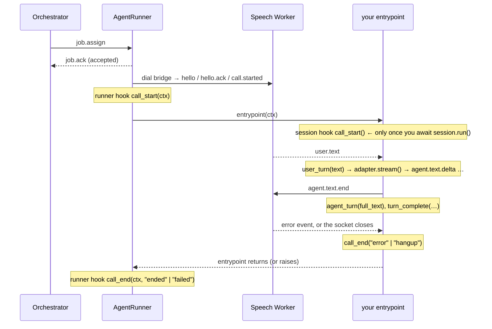

# Connectivity SDK — AgentRunner, Session, hooks and controls

The connectivity half of the SDK is two objects: an **AgentRunner** — the
long-lived process that registers under your `agent_id` and takes calls — and a
per-call **Session** that your entrypoint drives. This is the reference for
their parameters, methods, hooks and controls; the *narrative* of how a runner
registers, reconnects and fails over is in
[02-run-your-agent.md](02-run-your-agent.md). Every hook and control below is
stated as the code behaves: hooks that no `fire()` call raises are listed as
such, and controls whose wire format the Speech Worker does not act on are in
[Known gaps](#known-gaps).

```python
from unpod import AgentRunner, CallContext   # Session comes attached to ctx
```

`RunnerStats` and `CallMetrics` are not top-level exports —
`from unpod.models.session import RunnerStats, CallMetrics`.

## AgentRunner

```python
from unpod import AgentRunner, CallContext

async def entrypoint(ctx: CallContext) -> None:
    """Called once per call, on its own bridge connection."""
    ctx.session.dialog_machine = my_dialog_machine
    await ctx.session.say("Hello!")
    await ctx.session.run()          # blocks until the call ends

AgentRunner(
    entrypoint=entrypoint,
    agent_id="my-voice-agent",
    max_concurrent_calls=1,
    # api_key ← UNPOD_API_KEY, base_url ← UNPOD_BASE_URL. The runner dials
    # OUT per call, so no inbound port and no public URL are needed.
).start()
```

That is the shape `examples/full_agent_setup.py` runs.

### Constructor parameters

| Parameter | Type | Default | Behaviour |
|---|---|---|---|
| `entrypoint` | `Callable[[CallContext], Awaitable[None]]` | required | Awaited once per call, after the bridge handshake completes |
| `agent_id` | `str` | required | The rendezvous key. Must equal the `agent_id` on the Pipe (and on the number attachment) that routes the call |
| `api_key` | `str \| None` | `None` | Falls back to `UNPOD_API_KEY`; `ValueError` if neither is set |
| `max_sessions` | `int` | `50` | Capacity, *unless* `max_concurrent_calls` is passed |
| `max_concurrent_calls` | `int \| None` | `None` | **Overrides `max_sessions` whenever it is not `None`.** The winning value is advertised as `max_concurrent` in `Register` and gates `job.ack` rejections |
| `permits_per_minute` | `int` | `120` | Stored and never read — see [Known gaps](#known-gaps) |
| `drain_timeout_s` | `int` | `60` | How long `shutdown()` sleeps when any call is in flight |
| `dev_mode` | `bool` | `False` | Sets the registration pool to `f"{agent_id}@dev"`. That is its only effect — no hot reload exists |
| `base_url` | `str \| None` | `None` | Orchestrator WSS base. Resolution order below |
| `serving_url` | `str \| None` | `None` | Legacy `serve` transport only. Falls back to `UNPOD_RUNNER_URL` |
| `agent_secret` | `str \| None` | `None` | Legacy `serve` transport only (HMAC-verifies inbound bridge dials). Falls back to `UNPOD_AGENT_SECRET` |
| `transport` | `str` | `"dial_out"` | `"dial_out"` or `"serve"`; anything else raises `ValueError` in `__init__` |

Verified against `connectivity/runner.py::AgentRunner.__init__`.

**`serving_url` and `agent_secret` are deprecated.** Under the default
`dial_out` transport the runner never listens, so passing either raises a
`DeprecationWarning` and neither value is used: `serving_url` is read only by
`AgentRunner._serving_host_port` (the legacy bridge server's bind address) and
`agent_secret` only builds the `verify` callback that `AgentRunner._bridge_handler`
passes to the legacy server. Drop them, or pass `transport="serve"` if you are
still on the legacy model.

**Base-URL resolution.** `base_url` → `UNPOD_ORCHESTRATOR_URL` →
`wss://<host>` derived from `UNPOD_BASE_URL` (`_base_url.py::ws_base`) →
`wss://api.unpod.ai`. The SDK appends `/v1/internal/workers` itself
(`AgentRunner._WORKERS_PATH`), so pass a base, never a full path.

### Methods

| Call | Returns | Notes |
|---|---|---|
| `runner.start()` | `None` | Blocking. `asyncio.run(self.run())` |
| `await runner.run()` | `None` | Same loop, inside an event loop you already own |
| `await runner.shutdown()` | `None` | Sets the shutdown flag, then sleeps the full `drain_timeout_s` if any call is in flight. See [Known gaps](#known-gaps) |
| `runner.stats()` | `RunnerStats` | Live snapshot, table below |
| `runner.active_calls()` | `list[CallContext]` | The contexts currently between `call_start` and `call_end` |
| `@runner.on(event)` | decorator | Registers a runner-level hook; `ValueError` for a name outside `connectivity/hooks.py::VALID_EVENTS` |

### Runner-level hooks

Exactly two runner hooks fire. Both come from the bridge-connection callbacks
(`AgentRunner._track_call_start` / `AgentRunner._track_call_end`), so both fire
only for a real call — a rejected or timed-out handshake builds no context and
fires neither.

| Event | Handler signature | Fires |
|---|---|---|
| `call_start` | `(ctx: CallContext)` | Immediately before `entrypoint(ctx)` |
| `call_end` | `(ctx: CallContext, final_state: str)` | After the entrypoint returns or raises; `final_state` is `"ended"` or `"failed"` |

`runner.on("metric")` and every other name in `VALID_EVENTS` registers without
error and is never fired at the runner level — `AgentRunner` contains no other
`fire()` call. Per-call telemetry is a *session* hook.

```python
runner = AgentRunner(entrypoint=entrypoint, agent_id="my-voice-agent")

@runner.on("call_start")
async def _(ctx: CallContext) -> None:
    log.info("call started", call_id=ctx.call_id)

@runner.on("call_end")
async def _(ctx: CallContext, final_state: str) -> None:
    log.info("call finished", call_id=ctx.call_id, state=final_state)
```

`call_end` carries a different vocabulary from the session hook of the same
name: `"ended"`/`"failed"` describe *your entrypoint*, `"hangup"`/`"error"`
describe the conversation. All four are tabulated in
[02-run-your-agent.md § What `call_end` tells you](02-run-your-agent.md#what-call_end-tells-you).

### `RunnerStats`

| Field | Source | Read it as |
|---|---|---|
| `in_flight` | `len(self._active_calls)` | Live calls right now |
| `queued` | Hardcoded `0` | Nothing. The SDK never queues; the platform is the capacity gate |
| `completed_last_hour` | Counter incremented in `_track_call_end` | Entrypoints that returned normally **since process start** — not a rolling hour |
| `failed_last_hour` | Same counter pair | Entrypoints that raised, since process start — also not a rolling hour |
| `capacity` | `max_concurrent_calls or max_sessions` | The value advertised to the platform |
| `mean_call_duration_s` | `total_duration / completed_last_hour` | Sums *every* call's connected duration, including failed ones, but divides by the completed count only |

Verified against `connectivity/runner.py::AgentRunner.stats` and
`AgentRunner._track_call_end`. The field names promise a rolling window the
code does not implement; treat all four counters as lifetime totals.

### Several runners, one `agent_id`

Start N processes with the same `agent_id` and they form one pool: each mints
its own `worker_id` (`agent_id#<8 hex>`), each advertises its own capacity, and
the platform picks among them per call. That is both how you scale out and how
failover works — a single runner is a single point of failure. Capacity adds
up; there is no shared state between processes. The pick, the assign retry
budget and the registry TTL live on the platform side and are documented in
[02-run-your-agent.md § Reconnection and failover](02-run-your-agent.md#reconnection-and-failover).

## What fires, in order



## CallContext

The per-call envelope your entrypoint receives, built from the `call.started`
frame by `connectivity/bridge_server.py::_context_from_call_started`.

| Attribute | Type | Value |
|---|---|---|
| `call_id` | `str` | The frame's `session_id` — today the same string as `session_id` |
| `session_id` | `str` | Session identifier; the key `active_calls()` is indexed by |
| `agent_id` | `str` | The **call's** agent (from `call.started`), falling back to the runner's own |
| `runner_id` | `str` | The runner's own configured `agent_id`. On a multi-tenant runner this differs from `agent_id` above — do not conflate them |
| `direction` | `str` | `"inbound"` or `"outbound"`; defaults to `"inbound"` when the dispatch omits it |
| `user_number` | `str` | First non-empty of `user_number`, `caller_number`, `to_number`, `from_number` in the dispatch metadata; `""` if none |
| `instructions` | `str \| None` | Per-call prompt addendum from `calls.create(instructions=…)` |
| `data` | `dict` | Per-call data from `calls.create(data=…)`; otherwise the dispatch metadata minus the reserved keys. `voice_profile_id` is added when the frame carries one |
| `session` | `Session` | The object the rest of this doc is about |
| `room` | `dict` | Declared for media-room metadata but **never populated** — see [Known gaps](#known-gaps) |

Your dialog logic is text-only: audio stays inside the Speech Worker, and no
part of the SDK joins a media room or negotiates SDP.

## Session

### Hooks that fire

Register with `@session.on("<event>")`; handlers are coroutines, several per
event are allowed, and they run in registration order
(`connectivity/hooks.py::HookRegistry.fire`). Register them **before**
`await session.run()` — `run()` fires `call_start` on its first line.

| Event | Handler signature | Fired by |
|---|---|---|
| `call_start` | `()` | `Session.run`, entering the loop |
| `user_turn` | `(text: str)` | A `user.text` frame, before the adapter is asked to stream |
| `agent_turn` | `(full_text: str)` | End of a turn's stream, only when the turn produced text |
| `interruption` | `()` | `Session._apply_interrupt`, on a `user.interrupted` frame — mid-stream (the stream is cancelled) or between turns |
| `metric` | `(event: MetricEvent)` | A `metric` frame — `ttfa_ms`, `asr_p95_ms`, `tts_p95_ms`, `turns`, `cost_usd_so_far` |
| `state` | `(event: StateEvent)` | A `state` frame — `state` is one of `idle`, `listening`, `thinking`, `speaking`, `interrupted`, plus `turn_id`. Observability only; it never drives dialog |
| `error` | `(code, message, severity, source)` | An `error` frame. Four positional `str` args, in that order |
| `call_end` | `(reason: str)` | The loop's `finally`: `"error"` if an error frame ended it, else `"hangup"` |
| `llm_call` | keyword args only | `observability/__init__.py::ObservabilityManager.record_llm_call` |
| `turn_complete` | keyword args only | `ObservabilityManager.record_pipeline_scores` |

All eight of the first group are `self._hooks.fire(...)` calls in
`connectivity/session.py::Session.run` (or `_handle_passive_event` /
`_apply_interrupt`).

**`error`.** The argument order is `event.code, event.message, event.severity,
event.source` — note it does *not* match the field order of the event model.
The SDK types all four as plain `str` (`unpod/_protocol.py::ErrorEvent`); the
enumerations come from the Speech Worker, which sends `severity` ∈ `warn`,
`error`, `fatal` and `source` ∈ `stt`, `tts`, `transport`, `internal`
(supervoice `worker/bridge/protocol.py::ErrorEvent`). `code` is a free-form
string — `stt.processing_failed` and `<source>.pipeline_error` are the ones the
worker emits today, and the second reaches you only as `stt.pipeline_error` or
`tts.pipeline_error`. A failure in any *other* processor does not merely go
undelivered — it breaks the worker:
`worker/bridge/processor.py::AgentBridgeProcessor.process_frame` derives the
source from the failing processor's class name and falls back to `pipeline`,
then calls `emit_error(...)`, which builds `ErrorEvent(source="pipeline")`
before the `try` that guards the send — and neither of its early returns saves
you on a live call: the bridge client is attached, and `error` is always
negotiated, because the SDK's hello advertises it (`connectivity/bridge.py`)
and the worker's supported-event set contains it
(`worker/bridge/client.py::negotiate_from_hello`). `ErrorEvent.source` is
`Literal["stt", "tts", "transport", "internal"]`
(`worker/bridge/protocol.py::ErrorEvent`), so pydantic raises `ValidationError`
out of `emit_error` and out of `process_frame` — a live exception inside the
Speech Worker's own frame pipeline, not a silent drop. You see no `error` hook
either way; the difference is that the worker is now in trouble. Tracked in
[Known gaps](#known-gaps) as a supervoice bug. **Any error frame ends the
session loop**, including `severity="warn"`.

```python
async def entrypoint(ctx: CallContext) -> None:
    session = ctx.session          # there is no module-level `session`

    @session.on("error")
    async def _(code: str, message: str, severity: str, source: str) -> None:
        log.error("bridge error", code=code, severity=severity, source=source,
                  message=message)

    @session.on("state")
    async def _(event) -> None:
        log.debug("conversation state", state=event.state, turn=event.turn_id)

    await session.run()            # registration must precede run()
```

**`llm_call` and `turn_complete`** are fired with keyword arguments only, so
handlers must accept them by name (`**kwargs` is the safe shape). `llm_call`
additionally requires an adapter exposing `register_llm_callback` — the
`dialog_machine` setter wires it, and `SuperDialogAdapter` is the bundled
adapter that has it. It carries `turn_id`, `node_id`, `model`, `call_type`,
`latency_ms`, `tokens_in`, `tokens_out`, `prompt_messages`, `response_json`,
`edge_id`. `turn_complete` carries `turn_id`, `ttfa_ms`, `asr_ms`,
`llm_ttft_ms`, `tts_ttfb_ms`, `stt_ms`, `tts_ms`, `from_node`, `to_node`,
`llm_call_count`, `llm_total_ms`, `user_text`, `agent_text` — and fires from
two places, so a turn for which the worker also sends a `turn.metrics` frame
produces two `turn_complete` events with different payloads (the frame's
measured timings, and the session's own turn teardown).

`MetricEvent` and `StateEvent` live in the private `unpod._protocol` module.
Read their attributes; do not import the classes.

**Hook failures are not isolated.** `HookRegistry.fire` awaits each handler
with no `try`, and `Session.run` has no `except`, so an exception raised in a
handler propagates out of `run()` and out of your entrypoint — which the runner
counts as `final_state="failed"` and then redials. Catch inside your handlers.

### Hooks that never fire

`VALID_EVENTS` is wider than the set of events anything raises. These four
register without error and are dead:

| Event | Status |
|---|---|
| `user_partial` | No `fire("user_partial")` call exists in `src/`. Interim transcripts do not reach the SDK, and there is no `enable_partial_transcripts()` — that method does not exist |
| `silence` | No `fire("silence")` call exists. Silence/idle handling is the Speech Worker's, not the SDK's |
| `tool_call` | No `fire("tool_call")` call exists. Tool execution happens inside your adapter; observe it there |
| `tool_result` | No `fire("tool_result")` call exists |

If you need one of these, instrument your adapter — that is the layer that sees
partials, tools and results.

### Controls

```python
await session.say("Please hold while I check.")   # speak now, bypassing the adapter
await session.interrupt()                          # end the current agent response
await session.end(reason="completed")              # hang up
session.data["verified"] = True                    # per-call scratch dict
```

| Control | Wire verb | Effect |
|---|---|---|
| `await session.say(text)` | `agent.say` | The worker pushes the text verbatim through TTS |
| `await session.interrupt()` | `agent.text.end` | Closes the current agent response and releases the worker's turn gate so the next user turn is accepted. It does **not** cancel audio already playing |
| `await session.set_filler(text)` | `agent.say` | Broken — see [Known gaps](#known-gaps) |
| `await session.recording.pause(reason)` / `.resume()` | `agent.say` | Broken — see [Known gaps](#known-gaps) |
| `await session.end(reason)` | `agent.end_call` | The worker defers shutdown to its speech-done watcher, then ends the call with `end_reason=agent_end_call` |
| `session.data` | — | A plain `dict` the SDK only initialises: it is not passed to your adapter, not serialised, and read by nothing but your own code |

Barge-in needs no control call: an incoming `user.interrupted` frame cancels
the in-flight stream at the provider (`stream.aclose()`), fires `interruption`,
and — when the adapter exposes `mark_interrupted` — truncates the adapter's
last turn to what the caller actually heard.

### Transfers

One general method plus two conveniences, all sending `agent.transfer`:

```python
# General form
await session.transfer("+14155550100")                      # transfer_type="number"
await session.transfer("tier2", transfer_type="human", mode="warm",
                       announcement="Connecting you to a specialist.")

# Specific forms — same kwargs
await session.transfer_to_human("tier2", mode="cold")
await session.transfer_to_agent("senior-bot", announcement="One moment.")
```

| Parameter | Values | Default | Meaning |
|---|---|---|---|
| `target` | E.164 number, agent id, or queue name | required | Positional |
| `transfer_type` | `number`, `agent`, `human` | `"number"` | `transfer_to_human` sets `human`, `transfer_to_agent` sets `agent` |
| `mode` | `cold`, `warm` | `"cold"` | `cold` hands off immediately (SIP REFER where the trunk supports it) |
| `announcement` | `str` | `""` | Spoken before the agent leaves on a warm transfer; ignored for cold |

`mode="warm"` is an **announced** transfer, not a private consult: the human is
dialed into the same room, so the caller hears the ringing and the
`announcement` too. On a successful transfer the agent's job ends.

**Destination policy is the Speech Worker's, and it is opt-in.** The target is
LLM-chosen and therefore prompt-injectable, so the check runs worker-side —
never in the SDK and never in your prompt (supervoice
`worker/agent_adapter.py::VoiceAgentAdapter._handle_transfer`). What it does
*not* do is restrict destinations by default:

| `transfer_type` | Always checked | Allowlist |
|---|---|---|
| `number` | E.164 shape (`worker/transfer_policy.py::is_valid_e164`) — a malformed number is refused outright | Applied **only** when `transfer_allowed_numbers` or `transfer_allowed_prefixes` is set in pipe config |
| `human`, `agent` | — | Bypassed. `_handle_transfer` allows these unconditionally: the target is a queue or agent id resolved server-side, not a dialed number |

For PSTN targets the allowlist has three states
(`worker/transfer_policy.py::transfer_destination_allowed`): both keys unset —
the default — is **unrestricted**, so any well-formed E.164 number passes;
configured-but-empty is **deny-all**, the explicit lockdown; otherwise the
target must be an exact member of `transfer_allowed_numbers` or carry one of
`transfer_allowed_prefixes` (union, not intersection). If you dial out to
numbers your caller supplies, set one of those keys — the shape check alone is
not a toll-fraud gate.

A refused target is not an error and does not end the call: the worker speaks
`transfer_refusal_phrase` from pipe config (default *"I'm sorry, I can't
transfer you to that number."*), leaves the handover flag clear, and the
conversation continues. Your entrypoint sees no `error` frame and no
`call_end` — only the caller hears the refusal, so log the attempt yourself if
you need to know it happened.

### The `dialog_machine` slot

```python
from superdialog import DialogMachine

session.dialog_machine = DialogMachine(flow=flow, llm="anthropic/claude-haiku-4-5")
```

The setter (`Session.dialog_machine`) does three things: auto-wraps a
`superdialog` `DialogMachine` or `LLMAgent` in `SuperDialogAdapter`; accepts
anything satisfying the runtime-checkable `adapters/base.py::DialogAdapter`
protocol as-is; raises `TypeError` for anything else. It then wires the LLM
callback when the adapter has `register_llm_callback`, which is what powers the
`llm_call` hook and the usage ledger.

The protocol requires `turn()`, `stream()` and `assist()`. `stream()` is the
one `session.run()` calls on every live turn; steering methods such as
`set_llm`, `switch_flow` and `is_complete` are **not** protocol members — they
exist on `SuperDialogAdapter` and calling them on another adapter will fail.
`session.run()` does check `is_complete` after each turn (duck-typed) and calls
`await session.end("completed")` when it is true. The protocol, the bundled
adapters and the hot-path rule are covered in [04-adapters.md](04-adapters.md).

### `session.run()`

`await session.run()` is the loop: read bridge events, fire hooks, route user
text into `dialog_machine.stream()`, forward chunks as `agent.text.delta`, and
send exactly one `agent.text.end` per turn — interrupted or not, because that
frame is what releases the worker's turn gate. It returns when an `error` frame
arrives or the bridge goes away. An entrypoint that never calls `run()` gets no
session hooks at all.

### Metrics

`session.metrics.live()` returns a `CallMetrics` snapshot — but read the gap
first: nothing in `src/` calls `MetricsTracker.record_turn`, so every field
except `duration_s` is zero or empty on a real call. For live per-turn timings
use the `metric` hook (worker-measured) or `turn_complete`.

## Known gaps

Verified dead or broken surface, so you do not build on it.

| Gap | Detail |
|---|---|
| `set_filler()` | Sends `agent.say` with the text `__filler:<text>`. No `__filler` handling exists in supervoice; `worker/bridge/processor.py::AgentBridgeProcessor._handle_agent_say` pushes the text verbatim to TTS, so the caller hears the sentinel spoken aloud. Do not call it |
| `recording.pause()` / `recording.resume()` | Same mechanism: `agent.say` carrying `__recording_pause:<reason>` / `__recording_resume`, spoken verbatim for the same reason. There is no recording control on this wire (`connectivity/session.py::RecordingControl`) |
| Non-STT/TTS pipeline errors (**supervoice bug**) | An `ErrorFrame` from any processor whose class name contains neither `stt` nor `tts` makes `AgentBridgeProcessor.process_frame` compute `source="pipeline"`, which `ErrorEvent.source` (`Literal["stt","tts","transport","internal"]`) rejects — pydantic raises `ValidationError` inside the Speech Worker's frame pipeline. Symptom: no `error` hook fires and the worker logs a `ValidationError` from `emit_error`, not a bridge send failure. Owner: supervoice (`worker/bridge/processor.py`); the fix is mapping the fallback onto `internal` |
| `session.metrics.live()` | `MetricsTracker.record_turn` has no caller in `src/`, so `turns`, the p95s, `cost`, `tokens` and `active_llm` are always zero/empty; only `duration_s` is real |
| `ctx.room` | Declared as media-room metadata but never assigned — `_context_from_call_started` does not set it, and the `room_id` that `call.started` carries is not surfaced. Always `{}` |
| `RunnerStats.queued` | Hardcoded `0` in `AgentRunner.stats` |
| `permits_per_minute` | Stored on `self._permits_per_minute` and never read. It rate-limits nothing |
| Dead hooks | `user_partial`, `silence`, `tool_call`, `tool_result` register successfully and never fire |
| Hook exceptions | Not isolated: a raising handler ends the call and is charged to your entrypoint as `failed` |
| `shutdown()` | Sets the flag, then sleeps the whole `drain_timeout_s` when any call is in flight — no drain polling, no job cancellation, and (in `serve` mode) no listening-socket close, per its own `TODO` |

## Next

- [02-run-your-agent.md](02-run-your-agent.md) — registration, the identity
  trio, reconnection, failover, and the four `call_end` reasons in one table.
- [04-adapters.md](04-adapters.md) — what goes in the `dialog_machine` slot.
- [03-management-sdk.md](03-management-sdk.md) — the REST side: Pipes, numbers,
  and the outbound `calls.create` that fills `ctx.data` and `ctx.instructions`.
- [01-quickstart.md](01-quickstart.md) — a runner, a Pipe and a number in one
  verified run.
