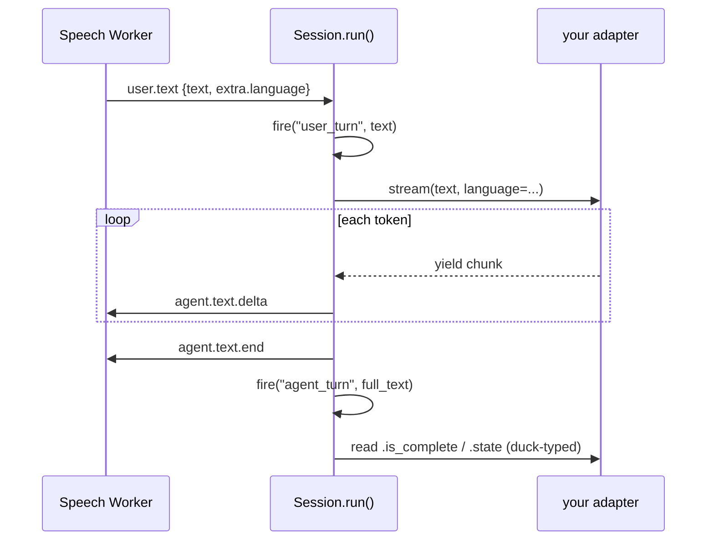

# Adapters — the `DialogAdapter` slot

An adapter is the object you assign to `ctx.session.dialog_machine`: it turns
what the caller said into what the agent says back. On a live call the
framework calls exactly one of its methods — **`stream()`** — and forwards
every token it yields straight to text-to-speech. This is the reference for
that protocol, for the six bundled adapters, and for writing your own. Read
the hot path section first: the most common way to ship a working adapter with
unusable audio is to implement `turn()` well and `stream()` as an afterthought.

```python
from unpod.adapters import (
    DialogAdapter,        # the protocol
    SuperDialogAdapter, LangChainAdapter, HTTPAdapter,
    MCPAdapter, OpenAIAdapter, AnthropicAdapter,
)
```

## The hot path: `stream()`

`connectivity/session.py::Session.run` is the per-call loop. On every final
transcript from the Speech Worker it calls your adapter once:

```python
stream = self._dialog_adapter.stream(text, language=language)
```

and then pumps that iterator, sending each non-empty chunk to the worker as an
`agent.text.delta` frame and exactly one `agent.text.end` when the turn
finishes. There is no buffering layer in between. What you yield is what the
caller hears, in the order and at the pace you yield it.



### What the framework passes

| Parameter | Passed by `Session.run`? | Value |
|---|---|---|
| `text` | Yes, positionally | The final transcript for this turn |
| `language` | Yes, **by keyword** | Per-turn language tag, or `None` |
| `context` | **Never** | Always the default. Nothing in `src/` supplies it |

`language` originates in the Speech Worker, not the SDK: supervoice's
`worker/bridge/processor.py::AgentBridgeProcessor._dispatch_turn` puts
`{"language": tag}` on the `user.text` frame's `extra` field — the
provider-reported STT language when there is one, otherwise a script-based
guess from `supervoice.speech.languages.detect_turn_language`. The SDK reads
it back off `_protocol.py::UserTextEvent` (which allows extra fields) and
hands it to you. It is `None` when the worker detected nothing.

> **Your `stream()` must accept `language` as a keyword.** `Session.run`
> passes it unconditionally and does not catch the `TypeError` a
> three-argument-only signature raises — the exception propagates out of
> `run()`, out of your entrypoint, and the runner records the call as
> `failed`. Copy the signature below exactly.

### Signature

```python
async def stream(
    self,
    text: str,
    context: dict | None = None,
    language: str | None = None,
) -> AsyncIterator[str]:
    ...
```

Two shape rules the type annotation does not enforce:

1. **Write it as an async generator** — `async def` plus `yield`. `Session.run`
   calls `stream(...)` *without* `await` and immediately calls `__anext__()` on
   the result. A coroutine that returns an iterator fails there.
2. **Yield real tokens.** A single `yield await self.turn(...)` satisfies the
   protocol and produces choppy audio: text-to-speech cannot start until the
   whole reply exists, so time-to-first-audio becomes full LLM latency.
   `adapters/base.py::DialogAdapter.stream` says so in its own docstring.

### Barge-in cancels you mid-stream

When the caller interrupts, `Session.run` cancels the pending chunk task and
calls `await stream.aclose()` on your generator — so the cancellation reaches
your provider's HTTP stream instead of leaving it draining into nothing. Your
generator sees `GeneratorExit` / `CancelledError` at its `yield`. Close
provider resources in a `finally:` block; do not swallow the cancellation.

`Session._apply_interrupt` then fires the `interruption` hook, calls
`mark_interrupted()` if you expose it (below), and calls `assist()` with a
built-in nudge telling your dialog engine the caller cut in.

## `turn()` — required member, never called live

```python
async def turn(self, text: str, context: dict | None = None) -> str: ...
```

`turn()` returns a complete reply string. **Nothing in the framework calls it
during a call** — `Session.run` only ever calls `stream()`. Inside the SDK it
is called in exactly two places, both of them an adapter's own `stream()`
falling back on it (`adapters/http.py`, `adapters/mcp.py`).

You still have to define it. `DialogAdapter` is `@runtime_checkable`, and the
`dialog_machine` setter admits a non-superdialog object only via
`isinstance(value, DialogAdapter)`, which checks that all three protocol
members are present. An adapter with `stream()` and `assist()` but no `turn()`
is rejected with `TypeError` before the first call. Treat it as a batch-mode
convenience for tests and offline evaluation.

## `assist()`

```python
def assist(self, text: str) -> None: ...
```

Injects a system-level instruction to apply from the next turn onward.
Synchronous, and expected to be cheap — queue the text, do not call an LLM.
Two callers: you (`session.dialog_machine.assist("caller sounds upset")`) and
`Session._apply_interrupt`, which uses it on every barge-in.

## Optional members

None of these are protocol members. `Session` probes each one with `hasattr`
or `getattr`, so omitting them is safe and implementing them adds behaviour.

| Member | Probed by | Effect when present |
|---|---|---|
| `register_llm_callback(fn)` | the `dialog_machine` setter | Wires the `llm_call` hook, Langfuse generation spans, and the usage ledger |
| `mark_interrupted(heard_text=None)` | `Session._apply_interrupt` | Truncates your engine's last reply to what the caller actually heard |
| `is_complete` (property) | `Session.run`, after each turn | Truthy ends the call with `session.end("completed")` |
| `state` (property) | `Session.run`, after each turn | Read for `from_node` / `node_id`, used to label observability spans |
| `set_llm(uri)` | nothing — you call it | Hot-swaps the model. `SuperDialogAdapter` only |
| `switch_flow(flow, preserve_memory=False)` | nothing — you call it | Swaps the active flow. `SuperDialogAdapter` only |

Of the six bundled adapters only `SuperDialogAdapter` implements any of them.

### `register_llm_callback` — what wires observability and billing

The `dialog_machine` setter checks `hasattr(adapter, "register_llm_callback")`
and, when it is there, hands the adapter an async callback. That one wire
carries three things:

- the **`llm_call` session hook**, so your handlers see every model call;
- **Langfuse generation spans** nested under the turn span — active only when
  `LANGFUSE_SECRET_KEY` is set
  (`observability/__init__.py::ObservabilityManager`);
- the **usage ledger**: `connectivity/usage.py::UsageReporter` accumulates
  prompt, completion, cache-read and cache-write tokens per session and
  flushes a delta on `call_end`. No-op unless `UNPOD_USAGE_INGEST_URL` is set.

An adapter without `register_llm_callback` still runs calls fine — you simply
get no `llm_call` hook and **no LLM tokens on the ledger**, because the SDK
half of it never sees them.

Call the callback once per model call with an object carrying these
attributes. `observability/__init__.py::ObservabilityManager.record_llm_call`
reads nine of them without guards: it passes them straight into the `llm_call`
hook fire, which has no `getattr` and no `try/except`, and which
`Session.__init__` always arms with a `fire_hook`. Miss one and the first
in-turn LLM call raises `AttributeError` — superdialog's
`toolcall_adapter.py::ToolCallAdapter.generate_reply` awaits the callback
unguarded, so it propagates into the turn.

The two cache counters are the tolerant pair, and the tolerance does not live
in `usage.py`: the `_llm_cb` closure inside the
`connectivity/session.py::Session.dialog_machine` setter reads `cached`,
`cache_write` and the token counts via `getattr` with defaults before passing
them as plain keywords to `connectivity/usage.py::UsageReporter.record_llm`.

| Attribute | Required | Used for |
|---|---|---|
| `latency_ms` | Yes | Per-turn `llm_total_ms` |
| `call_type`, `node_id` | Yes | Span name |
| `model` | Yes | Span model, and the provider/model split for billing |
| `prompt_messages`, `response_json` | Yes | Span input/output |
| `tokens_in`, `tokens_out` | Yes | Span usage plus billable counters |
| `edge_id` | Yes — the value may be `None`, the attribute may not be absent | Forwarded on the `llm_call` hook |
| `cached`, `cache_write` | No (default `0`) | Prompt-cache read/write counters |

That is superdialog's `machine/adapters/toolcall_adapter.py::LLMCallData`
shape, `edge_id: str | None` included — a field with no default, so the
dataclass enforces the same rule. Reuse it or mirror it.

Fire it inside a turn. `record_llm_call` returns early only while
`_current_turn_id` is `None`, which is true just once: before the first
`start_turn`. `ObservabilityManager.end_turn` clears `_current_span` but never
`_current_turn_id`, so from turn 2 onward a callback fired between turns is
recorded and attributed to the *previous* turn id. That early return also
covers the observability half alone — `_llm_cb` calls `record_llm` after
awaiting `record_llm_call`, so the tokens reach the usage ledger either way.

### `mark_interrupted` — keeping the transcript honest

```python
def mark_interrupted(self, heard_text: str | None = None) -> None: ...
```

On a barge-in your engine's last assistant message is a lie: it holds the whole
reply, but the caller only heard the part that had been spoken.
`mark_interrupted` is your chance to truncate it, so the next turn's prompt
matches the caller's reality. `Session._apply_interrupt` calls it when either
the worker supplied a `heard_prefix` or the interrupt landed mid-stream (in
which case `heard_text` is `None` and the tag alone is the signal).

`SuperDialogAdapter.mark_interrupted` is a best-effort passthrough: it forwards
only when the wrapped object exposes the method. In the superdialog tree this
SDK develops against, only `playbook/agent.py::PlaybookAgent` does — a
`DialogMachine` gets the no-op path and falls back to the `assist()` nudge.
See [Known gaps](#known-gaps).

## Assigning an adapter

```python
async def entrypoint(ctx: CallContext) -> None:
    ctx.session.dialog_machine = my_adapter   # or a superdialog object
    await ctx.session.run()
```

The `Session.dialog_machine` setter dispatches on what you assign, then wires
the LLM callback if the adapter exposes one. The dispatch is a three-way
branch:

| Assigned value | Result |
|---|---|
| A `superdialog` `DialogMachine` or `LLMAgent` | Auto-wrapped in `SuperDialogAdapter` |
| Anything passing `isinstance(x, DialogAdapter)` | Used as-is |
| Anything else | `TypeError` |

The second step is the `hasattr(adapter, "register_llm_callback")` probe
described [above](#register_llm_callback--what-wires-observability-and-billing):
whichever branch produced the adapter, this is where observability and billing
get attached.

Auto-wrap detection (`connectivity/session.py::_is_superdialog_type`) is by
class module and name — the class must live under a `superdialog` module and
be named `DialogMachine` or `LLMAgent`. Your own subclass in your own module
is not auto-wrapped; wrap it yourself:

```python
from unpod.adapters import SuperDialogAdapter

ctx.session.dialog_machine = SuperDialogAdapter(my_machine)
```

## The six bundled adapters

| Adapter | Wraps | Install | Streams natively? |
|---|---|---|---|
| `SuperDialogAdapter` | `superdialog.DialogMachine` / `LLMAgent` | `pip install "unpod[dialog]"` | Yes |
| `LangChainAdapter` | any LangChain Runnable | `pip install "unpod[langchain]"` | Yes (`astream`) |
| `OpenAIAdapter` | an `openai.AsyncOpenAI` client you build | core, plus your own `openai` install | Yes |
| `AnthropicAdapter` | an `anthropic.AsyncAnthropic` client you build | core, plus your own `anthropic` install | Yes |
| `HTTPAdapter` | one POST endpoint per turn | core | No — one chunk |
| `MCPAdapter` | an MCP server | `pip install "unpod[mcp]"` | Not implemented |

There is no `openai` or `anthropic` extra in `pyproject.toml`: those two
adapters take a client *you* construct, on *your* provider account. The extras
that exist are `dialog`, `langchain`, `mcp`, `observability`, `playground` and
`dev`.

### `SuperDialogAdapter`

The one adapter with the full optional surface: `register_llm_callback`,
`mark_interrupted`, `is_complete`, `state`, `set_llm`, `switch_flow`.

```python
from superdialog import DialogMachine, create_dialog_flow, PythonTool

flow = create_dialog_flow(
    prompt="Verify customer KYC. Ask for the last 4 digits of the ID.",
    llm="openai/gpt-4.1-mini",
)

def lookup_customer(id_last_4: str) -> dict:
    return crm.lookup(id_last_4)

ctx.session.dialog_machine = DialogMachine(     # auto-wrapped
    flow=flow,
    llm="anthropic/claude-haiku-4-5",
    tools=[PythonTool(fn=lookup_customer)],
)
```

| Adapter method | Wrapped call |
|---|---|
| `stream(text, language=…)` | `await dm.turn(text, stream=True)`, yielding each `StreamChunk.text` |
| `turn(text)` | `await dm.turn(text)` → `Turn.text` |
| `assist(text)` | `dm.assist(text)` |
| `register_llm_callback(fn)` | `dm.register_llm_callback(fn)`, else the graph adapter's `_on_llm_complete` |
| `mark_interrupted(heard)` | `dm.mark_interrupted(heard)` when present, else no-op |
| `set_llm`, `switch_flow`, `is_complete`, `state` | Straight through |

Two behaviours worth knowing:

- **`language` is dropped unless the wrapped object takes it.** The adapter
  probes `inspect.signature(dm.turn)` once at construction and forwards
  `language=` only when that parameter exists. Neither
  `dialog_machine.py::DialogMachine.turn` nor
  `agents/llm_agent.py::LLMAgent.turn` declares one today, so both currently
  ignore the per-turn language tag.
- **`switch_flow` takes a flow *name*, not a flow object.** The adapter's
  parameter is untyped, but `DialogMachine.switch_flow` looks the name up in
  the bound `FlowSet` and raises `KeyError` on a miss — and
  `NotImplementedError` outright on the playbook engine.

Wrapping an `LLMAgent` gets you a working `stream()` / `turn()` / `assist()`
and nothing else: `LLMAgent` has no `register_llm_callback`, `set_llm`,
`switch_flow`, `is_complete` or `state`, so the callback wiring silently
no-ops (no `llm_call` hook, no metered tokens) and the steering methods raise
`AttributeError`. That is what `examples/full_agent_setup.py` runs — fine for
a first call, not for a metered one.

### `LangChainAdapter`

```python
from langchain_openai import ChatOpenAI
from langchain_core.prompts import ChatPromptTemplate
from unpod.adapters import LangChainAdapter

chain = ChatPromptTemplate.from_messages([
    ("system", "You are a KYC verification assistant."),
    ("placeholder", "{messages}"),
]) | ChatOpenAI(model="gpt-4.1-mini")

ctx.session.dialog_machine = LangChainAdapter(chain)
```

Keeps history internally as a list of `{"role", "content"}` dicts and invokes
the chain with `{input_key: history}` — `input_key` defaults to `"messages"`,
which fits a `ChatPromptTemplate | ChatModel` chain. Pass
`LangChainAdapter(chain, input_key="input")` for a chain with a different
input schema. `stream()` uses `chain.astream()` and reads `chunk.content`
(falling back to `str(chunk)`); `assist()` appends a `system` message.

### `OpenAIAdapter` and `AnthropicAdapter`

Thin, history-keeping wrappers over one provider client each. You construct
and own the client, so the model spend lands on your provider account.

```python
from openai import AsyncOpenAI
from unpod.adapters import OpenAIAdapter

ctx.session.dialog_machine = OpenAIAdapter(
    AsyncOpenAI(),
    model="gpt-4o-mini",
    system_prompt="Keep every reply under two sentences.",
)
```

```python
from anthropic import AsyncAnthropic
from unpod.adapters import AnthropicAdapter

ctx.session.dialog_machine = AnthropicAdapter(
    AsyncAnthropic(),
    model="claude-haiku-4-5-20251001",
    system_prompt="Keep every reply under two sentences.",
    max_tokens=1024,
)
```

Both stream real deltas and append the assembled reply to history when the
stream ends. They differ on `assist()`: `OpenAIAdapter` appends a `system`
message mid-conversation; the Anthropic Messages API has no such thing, so
`AnthropicAdapter.assist` approximates it with a `[system] …` user message
plus a canned `"Understood."` assistant reply.

Neither implements `register_llm_callback`, so their token usage does not
reach the ledger — consistent, since those tokens are billed to you by your
provider rather than through Unpod.

### `HTTPAdapter`

One POST per turn to an endpoint you host.

```python
from unpod.adapters import HTTPAdapter

ctx.session.dialog_machine = HTTPAdapter(
    url="https://my-dialog.example/turn",
    headers={"Authorization": "Bearer sk_..."},
    timeout_s=10,
)
```

Request body: `text`, `context`, plus `system_instructions` (a **list** of
strings, present only when `assist()` was called since the last turn, and
cleared after send). The response must be JSON with a `"text"` key — anything
else raises `KeyError`, and a non-2xx status raises via `raise_for_status()`.

```json
{"text": "Sure — what are the last 4 digits of your ID?"}
```

`stream()` calls `turn()` and yields the whole reply as one chunk, so
time-to-first-audio is your endpoint's full latency. Acceptable for a
sub-second endpoint, audibly bad otherwise. There is no retry logic and no
per-call state: see [Known gaps](#known-gaps).

### `MCPAdapter`

Constructor-only today. `MCPAdapter.turn` checks that the `mcp` package is
importable and then raises `NotImplementedError`; `stream()` calls `turn()`,
so it raises too. Assigning one to `dialog_machine` succeeds and the first
user turn fails the call. Use `HTTPAdapter` in front of your own MCP host, or
do tool orchestration inside a `SuperDialogAdapter`.

## Writing a custom adapter

```python
from typing import AsyncIterator


class MyAdapter:
    """Wraps a proprietary conversation engine."""

    def __init__(self, engine) -> None:
        self._engine = engine
        self._pending: list[str] = []
        self._last_reply = ""

    # --- the hot path -----------------------------------------------------
    async def stream(
        self,
        text: str,
        context: dict | None = None,
        language: str | None = None,
    ) -> AsyncIterator[str]:
        for instruction in self._pending:
            self._engine.inject(instruction)
        self._pending.clear()

        parts: list[str] = []
        gen = self._engine.astream(text, language=language)
        try:
            async for token in gen:          # real tokens, not one blob
                parts.append(token)
                yield token
        finally:
            # Barge-in: Session.run() calls aclose() on this generator.
            self._last_reply = "".join(parts)
            await gen.aclose()

    # --- required for the isinstance gate; not called on live calls -------
    async def turn(self, text: str, context: dict | None = None) -> str:
        return "".join([chunk async for chunk in self.stream(text, context)])

    def assist(self, text: str) -> None:
        self._pending.append(text)

    # --- optional ---------------------------------------------------------
    def mark_interrupted(self, heard_text: str | None = None) -> None:
        self._engine.truncate_last_reply(heard_text)

    def register_llm_callback(self, fn) -> None:
        self._engine.on_llm_complete = fn    # fn is async; await it

    @property
    def is_complete(self) -> bool:
        return self._engine.finished

    @property
    def state(self) -> dict:
        return {"node_id": self._engine.step, "from_node": self._engine.prev}
```

Checklist before you ship it:

- [ ] `stream()`, `turn()` and `assist()` all defined — the `isinstance` gate
      needs all three even though only `stream()` runs live.
- [ ] `stream()` is an `async def` with `yield`, and accepts `language` as a
      keyword argument.
- [ ] It yields provider tokens as they arrive. If your engine cannot stream,
      say so in your own docs — the caller will hear the difference.
- [ ] Provider resources are released in a `finally:`, because barge-in closes
      the generator mid-yield.
- [ ] `register_llm_callback` is implemented if you want the `llm_call` hook,
      Langfuse spans, or LLM tokens on the ledger. The callback is `async` —
      `await` it.
- [ ] `assist()` is cheap and synchronous; it runs on every barge-in.
- [ ] `isinstance(MyAdapter(engine), DialogAdapter)` returns `True` in a test.

## Known gaps

Verified behaviour that will surprise you, so you do not build on it.

| Gap | Detail |
|---|---|
| `context` is dead | The protocol declares it on `turn()` and `stream()`; `Session.run` never passes it. Per-call data lives on `ctx.data` and `session.data` instead |
| `language` is dropped by `SuperDialogAdapter` | Forwarded only when the wrapped object's `turn()` declares a `language` parameter. Neither `DialogMachine.turn` nor `LLMAgent.turn` does today, so the worker's per-turn tag stops at the adapter. Owner: superdialog |
| `SuperDialogAdapter.mark_interrupted` usually no-ops | Only superdialog's `playbook/agent.py::PlaybookAgent` implements `mark_interrupted`; a wrapped `DialogMachine` never truncates and relies on the `assist()` nudge alone. Owner: superdialog |
| `MCPAdapter` is a stub | `turn()` raises `NotImplementedError`; the constructor does not, so the failure surfaces on the first user turn of a live call |
| `HTTPAdapter` has no retries | One `httpx.AsyncClient.post` plus `raise_for_status()`. A transient 502 fails the turn |
| `HTTPAdapter` never sends `session_id` | `_session_id` is initialised to `None` and assigned nowhere, so the field is always omitted. Key your endpoint's state off something you pass in `headers` |
| `LLMAgent` gets no metering | superdialog's `LLMAgent` has no `register_llm_callback`, so `SuperDialogAdapter` wires nothing and its tokens never reach `UsageReporter` |

## Next

- [04-connectivity-sdk.md](04-connectivity-sdk.md) — the `Session` around this
  slot: hooks, controls, `run()`, and which hooks actually fire.
- [02-run-your-agent.md](02-run-your-agent.md) — where the process running your
  adapter lives, and how it registers and fails over.
- [01-quickstart.md](01-quickstart.md) — a runner, a Pipe and a number in one
  verified run.
- [00-overview.md](00-overview.md) — what Unpod owns versus what you own, and
  the terminology canon.
