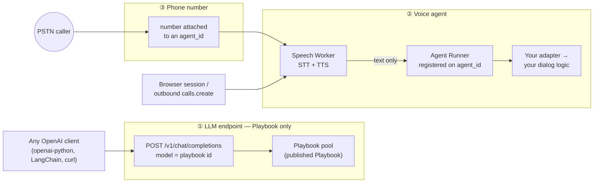

# Deployment

There are three ways to put an agent in front of real traffic: as an **LLM
endpoint** (a Playbook answering as an OpenAI chat model), as a **voice agent**
(an Agent Runner registered under an `agent_id`), and behind a **phone number**
(a PSTN number attached to that same `agent_id`). All three are shipped; only
two of them have an SDK surface. This doc says what each mechanism deploys,
which call performs it, what must already be running for it to work, and which
neighbouring ideas are still roadmap.

## At a glance

| # | Mechanism | Status | What you call | What must already be running |
|---|---|---|---|---|
| 1 | LLM endpoint | **Shipped** — platform-side, no SDK surface | Any OpenAI client against `POST /v1/chat/completions` | A Playbook published with `enable_endpoint=true`, and the playbook pool's OpenAI door |
| 2 | Voice agent | **Shipped** | `unpod.AgentRunner(...).start()` | Nothing — the runner *is* the thing you start |
| 3 | Phone number | **Shipped** | `client.telephony.numbers.attach(..., agent_id=)` | Mechanism 2, live under the same `agent_id` |

Mechanism 3 stacks on mechanism 2: a number routes to an `agent_id`, and that
handle is dead weight unless an Agent Runner is registered under it. Mechanism 1
stands alone — no runner, no Pipe, no number — but it serves a **Playbook**
only. Your own dialog logic (LangChain, HTTP, MCP, `OpenAIAdapter`,
`AnthropicAdapter`, a custom adapter) reaches live traffic through mechanisms 2
and 3.



---

## 1. Deploy as an LLM endpoint — **Shipped**

A published Playbook is exposed as an OpenAI chat model: the `model` field names
the playbook, a session id makes the conversation stateful, and any OpenAI
client works unchanged. Nothing registers, nothing dials, no audio is involved.

**How it is turned on.** Publishing with `enable_endpoint=true` sets
`endpoint_enabled: true` on the playbook document — supervoice
`platform/models/playbook.py::PlaybookPublishRequest.enable_endpoint`, written
by `platform/routers/playbooks.py::publish_playbook`. This is a *separate door*
from a voice-agent publish: a plain publish never sets the key, and the endpoint
flag never turns itself off. Publishing is a platform action, not an SDK call —
`publish` appears nowhere under `src/unpod`.

**Where it runs.** The playbook pool's second front door, deployed as its own
process/pod: handler `playbook_pool/openai_api.py::build_openai_app`, entrypoint
`playbook_pool/openai_main.py::build_app`. It shares the pool's resolver,
session store and `PlaybookMachine` with the voice door, so a session started on
one transport can be resumed on the other.

| Aspect | As shipped |
|---|---|
| Route | `POST /v1/chat/completions`, plus `GET /health` |
| Auth | The caller's own Bearer JWT, resolved to a trusted `org_id` server-side (`playbook_pool/auth_me.py::resolve_org_id`). Fail-closed: no token, bad token, or any `auth/me` failure → 401. Not your `UNPOD_API_KEY` |
| `model` | The playbook id. Unknown or unpublished for the org → 404 `model_not_found` |
| Statefulness | The `user` body field or the `X-Session-Id` header. Absent → a fresh `sess_<uuid4>` per request |
| Turn semantics | Only the **last** `role:"user"` message drives the turn (`playbook_pool/openai_api.py::_last_user_text`); `system` is ignored — the Playbook is the system prompt |
| Streaming | `stream: true` → SSE `chat.completion.chunk` frames terminated by `data: [DONE]` |

The full contract — every error code, the session table, the deployment env — is
supervoice
[`docs/api/playbook-openai-endpoint.md`](../../supervoice/docs/api/playbook-openai-endpoint.md);
the publish side and the pool it runs on are
[`docs/03-publish-and-runners.md`](../../supervoice/docs/03-publish-and-runners.md).
*(Both paths are sibling checkouts of the supervoice repo, not files in this
package.)*

### Consuming it from this SDK

There is no endpoint client in `unpod`; you point an OpenAI client at the door.
`OpenAIAdapter` takes a client you construct (`adapters/openai.py::OpenAIAdapter`),
so it can be aimed at the door's base URL — with one trap:

> `OpenAIAdapter` sends its whole accumulated `_history` on every turn and never
> sets `user`. The door reads only the last user message and mints a new session
> id when `user` is absent, so **every turn starts the Playbook over at
> checkpoint 0**. Use it for one-shot calls, or write a thin adapter that pins a
> session id per call. *(Verified against code, not run live:
> `adapters/openai.py::OpenAIAdapter.stream` passes only `model`, `messages`,
> `stream`.)*

### The local alternative: `superdialog eval serve`

For development against a playbook file on disk, superdialog ships the same
OpenAI shape with no platform, no org auth and no publish step:

```bash
superdialog eval serve --playbook my_agent.simple.yaml --port 8000
```

`cli/main.py` wires the subcommand to `eval/cli.py::cmd_serve`, which builds
`eval/server/openai_server.py::build_app`. The two doors are compared side by
side in superdialog
[`docs/08-integrations.md`](../../superdialog/docs/08-integrations.md) §2 —
Door A (`eval serve`, dev) versus Door B (the supervoice playbook pool,
production).

---

## 2. Deploy as a voice agent — **Shipped**

A voice agent is a long-lived process registered under an `agent_id`. Two places
that process can live, one of which is fully yours:

| | Self-hosted Agent Runner | Publish (Unpod-hosted) |
|---|---|---|
| Status | **Shipped** — the SDK's core surface | **Shipped, partial** — provisions the binding, does not start your process |
| You call | `AgentRunner(entrypoint=..., agent_id=...).start()` | Nothing in this SDK: `publish` appears nowhere under `src/unpod` |
| Runs | Any Python, any adapter, your own LLM keys | A published Playbook on the playbook pool |
| Deploy step | Start the process wherever you like — no inbound port, no tunnel, no public URL | `POST /platform/v1/playbooks/{playbook_id}/publish` from the platform |

The runner holds one outbound WebSocket to the orchestrator and dials the Speech
Worker's bridge per call (`connectivity/runner.py::AgentRunner`, transport
`dial_out`), which is why deployment is "run the process" and nothing more —
NAT, firewalls and dynamic IPs are all irrelevant.

**What Publish does and does not deliver today.** It promotes the draft
Playbook, derives an `agent_id` from the slug, stamps it on both the playbook and
its Pipe, and — for a logged-in owner — provisions the Pipe and claims a number.
It does not start a runner for that handle: a slug-derived `agent_id` gets no
playbook-pool fallback, so *someone still has to run a process registered under
exactly that string*. The full step-by-step, with a verification checklist per
step, is
[02-run-your-agent.md § Local runner vs Publish](02-run-your-agent.md) here and
supervoice
[`docs/03-publish-and-runners.md`](../../supervoice/docs/03-publish-and-runners.md)
on the platform side.

Scaling and failover are a property of this mechanism, not a separate one: start
N runners with the same `agent_id` and the orchestrator picks among them per
call. [02-run-your-agent.md](02-run-your-agent.md) covers the identity trio,
reconnection, the two-phase assign and the `call_end` vocabularies;
[04-connectivity-sdk.md](04-connectivity-sdk.md) is the `AgentRunner` /
`Session` reference; [05-adapters.md](05-adapters.md) is what the agent says once
a call lands.

---

## 3. Deploy behind a phone number — **Shipped**

Attaching a number is the one deployment step with a first-class SDK call:

```python
result = await client.telephony.numbers.attach(
    "+14155550101",              # one E.164 string, or a sequence of them
    agent_id="my-voice-agent",   # the same handle your Agent Runner registers under
)
r = result.numbers[0]
print(r.ok, r.connection_state, r.error)
```

`telephony/__init__.py::NumbersResource.attach` — everything after `numbers` is
keyword-only (`agent_id`, `attach_type`, `pipe_id`, `bridge_slug`, `region`). It
takes the **phone number, not an id**; the platform resolves it, owns the E.164
rule, and reports per-number `ok`/`error` so a batch can partially succeed.

Two preconditions decide whether this call works on the first try:

| Precondition | Detail |
|---|---|
| Org-scoped auth | The telephony plane is `Org-Handle`-scoped: `TokenAuth`/`JWTAuth` with an `org_handle` (or `UNPOD_PLATFORM_TOKEN` + `UNPOD_ORG_HANDLE`). A bare Bearer `UNPOD_API_KEY` is refused |
| A platform agent owning the handle | On the default `attach_type="agent"`, the platform gates the request on agent ownership *before touching any number* and 400s with `"Agent not found for this organization."` if no platform agent carries that handle. A Pipe or a running Agent Runner does not satisfy it. The escape hatch is `attach_type="pipeline"` with a `pipe_id`, which is exempt from that gate |

Both are spelled out with the exact platform symbols in
[03-management-sdk.md § Numbers — two surfaces, one verdict](03-management-sdk.md),
which is also the reference for `detach`, `overview()`, the `connection_state`
lifecycle, and why `client.numbers` (the other number surface) is legacy.

Outbound calls are the mirror image and need no number attachment —
`client.calls.create(agent_id=..., to_number=...)` resolves the Pipe
server-side — but they carry their own publish gate; see
[01-quickstart.md § Known gaps](01-quickstart.md#known-gaps) (#2).

---

## Choosing between them

| If you want… | Use |
|---|---|
| A Playbook callable as a chat model from existing LLM code | Mechanism 1 |
| Your own Python on live voice calls | Mechanism 2 |
| A phone number the public can dial | Mechanism 3 on top of 2 |
| Outbound calls from your own code | Mechanism 2, then `calls.create(agent_id=)` |
| A Playbook on voice without running a process yourself | Publish — with the caveat above that a runner must still be live under the handle |

## Known gaps

Verified limits of the mechanisms above, so you do not plan around surface that
is not there:

| Gap | Detail |
|---|---|
| No SDK publish | Neither mechanism 1 nor the hosted half of mechanism 2 has an SDK call; both are platform actions. `publish` appears nowhere under `src/unpod` |
| Endpoint metering not pushed | The OpenAI door computes token `usage` per response, but the ledger push is an unwired seam (the `report` parameter on `playbook_pool/openai_api.py::build_openai_app`) |
| No `/v1/models` on the door | Listing an org's playbooks as models needs a catalogue endpoint the resolver does not have |
| Endpoint serves Playbooks only | The OpenAI door resolves a *published Playbook*; there is no equivalent door in front of an arbitrary SDK adapter |
| Publish leaves the handle unserved | A slug-derived `agent_id` has no playbook-pool fallback, so publish alone does not make a voice agent answerable — see [02-run-your-agent.md](02-run-your-agent.md) |

## Roadmap

> **Status: roadmap — not built.** No code exists for any of the items below;
> each was checked against `src/unpod`, supervoice `src/supervoice` and
> superdialog `src/superdialog` before being listed here. Tracked in supervoice
> [`docs/03-publish-and-runners.md` § Roadmap](../../supervoice/docs/03-publish-and-runners.md).

- **STS plugin for LiveKit / Pipecat.** A speech-to-speech runner plugin that
  bypasses the STT → LLM → TTS pipeline, droppable into a LiveKit or Pipecat
  app. What ships today is the text-LLM shape instead: superdialog
  `adapters/livekit.py::DialogMachineLLM` and
  `adapters/pipecat.py::make_processor` hand a Playbook to those frameworks as a
  *text* brain, and Unpod's own voice path keeps audio inside the Speech Worker.
- **Docker-image-per-agent publish.** Publish would build and deploy a dedicated
  container per agent instead of binding into the shared hot-load playbook pool.
  Today publish never builds an image.
- **Export flow.** Download a published agent (Playbook plus runner scaffold) to
  self-host it.
- **Editor agent.** An agent that edits Playbooks conversationally from inside
  the product.

## Next

- [02-run-your-agent.md](02-run-your-agent.md) — the runner half of mechanism 2:
  identity trio, `dev_mode`, reconnection, failover, `call_end`.
- [03-management-sdk.md](03-management-sdk.md) — mechanism 3 in full, plus auth
  precedence and the two number surfaces.
- [01-quickstart.md](01-quickstart.md) — Pipe → runner → number → first call,
  transcribed from a verified run.
- [00-overview.md](00-overview.md) — what Unpod owns versus what you own, and
  the terminology canon.
