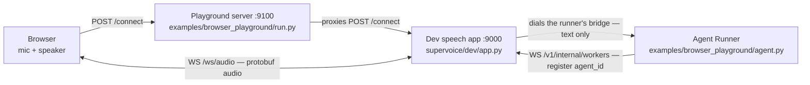

# Browser Quickstart — Test an Agent Without a Phone Number

The browser path runs the same Agent Runner you would later put behind a phone
number, with a laptop mic in place of PSTN. Everything you run lives in
[`examples/browser_playground/`](../examples/browser_playground/README.md): a
small server that builds and serves the UI on `:9100` and runs your agent
in-process, pointed at a supervoice dev speech app you start yourself on
`:9000`. No number, no Pipe, no telephony account. Read
[Step 3](#step-3--make-the-runner-speak-the-dev-apps-transport) before you
start — as shipped, the example's runner and the dev speech app disagree about
transport, and the runner exits at startup until you say so explicitly.

## What you run

| Process | Command | Port | Role |
|---|---|---|---|
| Dev speech app | `uv run uvicorn supervoice.dev.app:create_dev_app --factory --port 9000` (from a supervoice checkout) | 9000 | Hosts the Speech Worker runtime plus the browser ingress and the worker registry |
| Playground server + UI | `task playground` (from `unpod-sdk/`) | 9100 | Builds `pipe-ui`, serves it, proxies `POST /connect`, runs your agent in-process |
| Your Agent Runner | in-process by default; `EXTERNAL_AGENT=1` runs it yourself | — | Registers under `agent_id`, answers turns as text |

This path is not hosted. `POST /connect` and `WS /ws/audio` exist only in
`supervoice/dev/app.py`; the platform app does not expose browser audio, so
pointing the playground at `api.unpod.ai` gives you a UI and no call.

## How it fits together



Mind the last edge: on this path the speech app dials the runner. That is the
deprecated `serve` transport, and it is the reason for Step 3.

## Prerequisites

- `uv`, plus Node and npm — the UI is a Vite app and `pipe-ui/dist` is not
  committed, so `task playground` runs `npm install && npm run build` first
  (Taskfile target `playground-ui-build`).
- A supervoice checkout you can run.
- Provider keys, split by side:

| Side | Keys | Read by |
|---|---|---|
| Speech (supervoice) | `DEEPGRAM_API_KEY` for STT **and** `CARTESIA_API_KEY` for TTS — both, not either | `supervoice/speech/api_keys.py::PROVIDER_API_KEYS` maps provider → env var; the profile is `supervoice/dev/app.py::_FALLBACK_PROFILE` |
| Agent (this SDK) | `OPENAI_API_KEY` or `ANTHROPIC_API_KEY` | `examples/browser_playground/agent.py::_pick_llm`; `run.py::_check_keys` exits with status 1 when neither is set |

Cartesia is not one of two TTS options here. The browser path never sends a
`voice_profile_id` — `pipe-ui/src/app.ts` calls `/connect?agent_id=…` and
`run.py::connect` forwards only `agent_id` — so
`supervoice/dev/app.py::_resolve_profile` returns
`supervoice/dev/app.py::_FALLBACK_PROFILE`, whose chains are STT
`soniox → deepgram` and TTS **`cartesia` alone**.
`supervoice/speech/failover.py::resolve_tts_with_fallback` walks only that
chain, and its `LAST_RESORT_TTS_PROVIDER` is `cartesia` too (appended only when
`SUPERVOICE_LAST_RESORT_TTS_VOICE_ID` is set). With only `DEEPGRAM_API_KEY` and
`OPENAI_API_KEY` set, every step below succeeds and the first call dies at
`ProviderSetupError` with no audio.

That fallback profile is also Hindi-tuned: `language="hi"` on both chains. The
seed catalog `supervoice/platform/seed/voice_profiles.py::GLOBAL_PROFILES`
holds eight profiles across OpenAI, Cartesia, Sarvam and Soniox, but it is
keyed by `voice_profile_id` and nothing on this path passes one (see
[Rough edges](#rough-edges)) — it is the source for the voice-profiles list,
not the profile-less fallback. To change voice or language, edit
`_FALLBACK_PROFILE` in your supervoice checkout.

## Step 1 — Start the dev speech app

```bash
cd supervoice
uv run uvicorn supervoice.dev.app:create_dev_app --factory --port 9000
```

`supervoice/dev/app.py::create_dev_app` loads `.env` from the directory you
launch it in (with `override=True`), so keep the speech keys in
`supervoice/.env`. With no `SUPERVOICE_SESSION_API_KEY` configured it logs an
insecure-mode warning and leaves the legacy `POST /connect` door open — which
is the door the playground knocks on. Set that variable and
`supervoice/dev/app.py::connect` answers `403` instead.

## Step 2 — Configure the playground

```bash
cd unpod-sdk
cp examples/browser_playground/.env.example examples/browser_playground/.env
```

Edit `examples/browser_playground/.env`. For a local dev speech app the two
lines that matter are:

```bash
SUPERVOICE_URL=ws://127.0.0.1:9000
OPENAI_API_KEY=sk-...
```

| Variable | Default | Effect |
|---|---|---|
| `SUPERVOICE_URL` | `run.py`: this value, else `ws(s)://<UNPOD_BASE_URL host>`, else `ws://127.0.0.1:9000`. `agent.py`: this value, else `ws://127.0.0.1:9000` | The speech app base. `/connect` and `/ws/audio` are derived from it (`examples/browser_playground/_urls.py`) and it is the runner's `base_url` |
| `PLAYGROUND_PORT` | `9100` | Port the UI server binds |
| `AGENT_ID` | `browser-playground` | The `agent_id` the runner registers under |
| `UNPOD_API_KEY` | `dev-key` | Bearer sent on the registration socket; the dev registry never reads it |
| `OPENAI_API_KEY` / `ANTHROPIC_API_KEY` | — | Picks the LLM; `SUPERDIALOG_LLM` overrides the model string outright |
| `FLOW_JSON_PATH` | unset | A path to a flow JSON runs a `DialogMachine` with a spoken greeting; unset runs a plain `LLMAgent` |
| `EXTERNAL_AGENT` | `0` | `1` serves the UI only and leaves the runner to you |

Set `SUPERVOICE_URL` explicitly. `run.py` falls back to `UNPOD_BASE_URL`
through `unpod._base_url.ws_base`, but `agent.py` does not — with only
`UNPOD_BASE_URL` set, the proxy and the runner point at different hosts.

## Step 3 — Make the runner speak the dev app's transport

`examples/browser_playground/agent.py::build_runner` constructs `AgentRunner`
with the SDK default `transport="dial_out"`. The dev speech app's registry is
still the deprecated `serve` model: `supervoice/dev/relay.py::workers_endpoint`
replies `{"type": "registered", "heartbeat_interval_s": 30}` with no
`transport_ack`, and
`unpod/connectivity/runner.py::AgentRunner._control_session` treats a missing
ack as a hard, non-retriable failure:

```text
orchestrator did not acknowledge dial_out transport — upgrade supervoice or
construct AgentRunner(transport='serve')
```

Until the example is fixed, add the two arguments yourself:

```python
# examples/browser_playground/agent.py::build_runner
return AgentRunner(
    entrypoint=entrypoint,
    agent_id=AGENT_ID,
    base_url=SUPERVOICE_URL,
    api_key=os.getenv("UNPOD_API_KEY", "dev-key"),
    transport="serve",                    # the dev speech app dials you
    serving_url="ws://127.0.0.1:8765",    # where it dials
)
```

`serving_url` is what the registry stores and what the speech app dials at call
time (`supervoice/dev/relay.py::_resolve_worker`, consumed by
`supervoice/dev/app.py::_run_client_job`). The runner derives its listen
address from the same URL in `AgentRunner._serving_host_port`, which defaults
to `0.0.0.0:8765` when you omit it. Nothing else about your agent changes:
`serve` and `dial_out` differ only in who opens the socket.

Against the hosted orchestrator, leave the default alone — it acknowledges
`dial_out` (`supervoice/orchestrator/worker_registry/dispatch.py::WorkerDispatchServer.accept`)
and `serve` is scheduled for teardown.

## Step 4 — Run it

```bash
task playground
```

The target builds the UI, frees `:9100`, starts the server with the agent as an
in-process task, and opens `http://localhost:9100`. Click **Connect**, allow
mic access, and speak. The page shows a live transcript, STT latency on each
user turn, and TTFA plus total latency on each agent turn
(`examples/browser_playground/pipe-ui/src/app.ts`).

## What connects where

| Hop | Endpoint | Handled by |
|---|---|---|
| Browser → playground | `POST /connect?agent_id=…` | `run.py` — proxies the speech app and rewrites `ws_url` to `<SUPERVOICE_URL>/ws/audio` |
| Playground → speech app | `POST /connect` | `supervoice/dev/app.py::connect` — legacy door, insecure mode only |
| Browser ↔ speech app | `WS /ws/audio` | `supervoice/dev/app.py::audio_ws` — protobuf audio over the Pipecat WebSocket transport |
| Runner → speech app | `WS /v1/internal/workers` | `supervoice/dev/relay.py::workers_endpoint` — registration and heartbeat |
| Speech app → runner | the runner's bridge socket at `serving_url` | `supervoice/dev/app.py::_run_client_job` — text frames only |

Audio stops at the speech app. Only text crosses to your Agent Runner, exactly
as it does on the phone path.

## Two-process mode

To edit `agent.py` without restarting the server, run the two halves apart:

```bash
# terminal 1 — server and UI only
EXTERNAL_AGENT=1 task playground

# terminal 2 — your agent
cd examples/browser_playground
uv run --extra playground --env-file .env python -c \
  "import asyncio, agent; asyncio.run(agent.run_agent())"
```

Neither flag is decoration. `--extra playground` is what `task playground`
itself uses to get `superdialog` and `loguru`; `--env-file` matters because
`run.py` is what loads `.env` and `agent.py` does not, so a bare `uv run`
leaves the agent with no LLM key and with default values for `SUPERVOICE_URL`
and `AGENT_ID`.

For live UI reload, run `npm run dev` in `pipe-ui` instead of rebuilding. That
dev server listens on `:5173` and proxies `/connect` and `/ws` straight to
`SUPERVOICE_URL`, bypassing the playground server
(`examples/browser_playground/pipe-ui/vite.config.ts`).

## Rough edges

| What | Where | What it costs you |
|---|---|---|
| The example registers with `dial_out`; the dev registry only speaks `serve` | `agent.py::build_runner` vs `supervoice/dev/relay.py::workers_endpoint` | The runner exits at startup until you apply Step 3. Raised for the supervoice known-gaps backlog |
| The agent id never reaches the speech app | `examples/browser_playground/_urls.py::audio_ws_url` returns `<SUPERVOICE_URL>/ws/audio` with no query string, and `run.py::connect` overwrites the proxied `ws_url` with it — discarding the query `supervoice/dev/app.py::connect` had built | `supervoice/dev/app.py::audio_ws` provisions every call with `agent_id or "default"`, so routing survives only through `supervoice/dev/relay.py::_resolve_worker`'s sole-registered-worker fallback. Two runners registered under different `agent_id`s cannot be routed between on this path: `_resolve_worker` returns `None` and `_run_client_job` refuses the call. Un-hardcoding `const AGENT_ID` in `pipe-ui/src/app.ts` would change nothing, and the same rewrite is why `voice_profile_id` cannot be passed either |
| `.env.example` defaults to the hosted platform, its README to localhost | `examples/browser_playground/.env.example` vs `examples/browser_playground/README.md` | The hosted platform serves no browser audio: the UI loads and **Connect** fails |
| `agent.py` never loads `.env` | `run.py` loads it before importing `agent` | Two-process mode needs `uv run --env-file .env` or exported variables |
| `POST /connect` is the legacy door | `supervoice/dev/app.py::connect` | It closes the moment `SUPERVOICE_SESSION_API_KEY` is set; the current ingress is `POST /v1/sessions` (see [00-overview.md](00-overview.md)) |

## Next

| Next step | Doc |
|---|---|
| The phone path, end to end | [01-quickstart.md](01-quickstart.md) |
| Where the runner process lives, identity, failover | [02-run-your-agent.md](02-run-your-agent.md) |
| Hooks, controls, transfers | [04-connectivity-sdk.md](04-connectivity-sdk.md) |
| Reaching real traffic | [06-deployment.md](06-deployment.md) |
