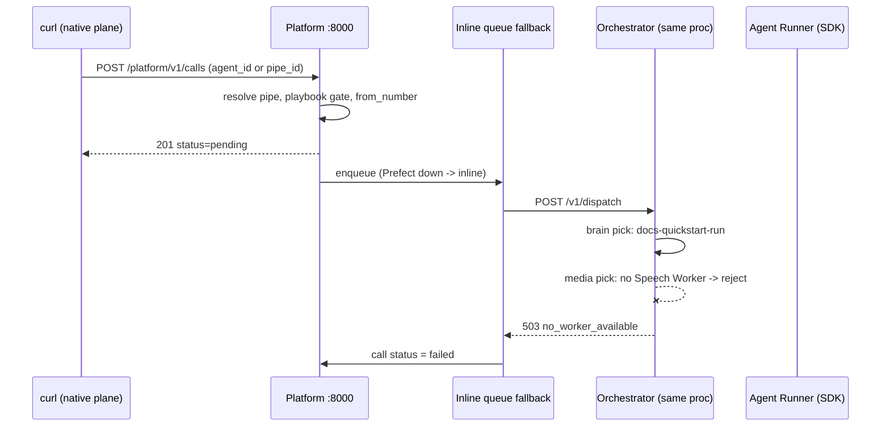

# Quickstart verification run — 2026-07-28

Live end-to-end run of the SDK flow (`examples/full_agent_setup.py` stages:
setup → runner → call → monitor) against a locally started supervoice
platform, recording every command and its real result. Every stage was
executed live; the SDK management surface's failures below are real observed
output, not predictions. Input to the quickstart rewrite (plan Task 14) and
the docs audit (`supervoice/docs/plans/2026-07-28-docs-audit-unpod-sdk.md`
in the super repo).

## Verdict summary

| Stage | Verdict | One-line result |
|---|---|---|
| Stack bring-up | LIVE-VERIFIED | `supervoice.main:app` on :8000, `/health` ok, remote Mongo + LiveKit engine from `supervoice/.env` |
| API key mint | LIVE-VERIFIED | Taskfile `create-api-key` curl is stale (401); the on-behalf bootstrap path works |
| Setup — `voice_profiles.list()` | LIVE-VERIFIED (fails) | 404 — targets the backend-core plane local supervoice does not serve |
| Setup — `pipes.create/list` (SDK) | LIVE-VERIFIED (fails) | 404 — every management path double-prefixes against local supervoice |
| Setup — pipe via native plane | LIVE-VERIFIED | Pipe created and bound to `agent_id`, voice profile attached by name |
| Runner — `AgentRunner` | LIVE-VERIFIED | Registered over WSS; visible in `GET /v1/workers` with `transport=dial_out` |
| Call — `calls.create` (SDK) | LIVE-VERIFIED (fails) | Same 404 path problem |
| Call — both forms, native plane | LIVE-VERIFIED | `agent_id=` and `pipe_id=` forms both 201 after a Playbook publish |
| Call — actual PSTN dial | STATIC-ONLY (no SIP trunk, no Speech Worker running) | Inline dispatch ran; brain pick chose the SDK runner; media leg rejected |
| Monitor (SDK) | LIVE-VERIFIED (fails) | Same 404 path problem |
| Monitor — native plane | LIVE-VERIFIED | Both calls listed with terminal status |
| Browser playground | STATIC-ONLY (wall-clock budget) | Paths/README verified against `examples/browser_playground/` only |

"LIVE-VERIFIED (fails)" means the command genuinely ran against the live
stack and the recorded failure is its real behavior today — the exact thing
the new quickstart must not teach.

## Environment

| Item | State |
|---|---|
| Python env | `supervoice/.venv`, resolving editable `../superdialog` and `../unpod-sdk` (both confirmed via `module.__file__`) |
| Mongo | Reachable through the app (remote DSN from `supervoice/.env`; local :27017 closed) |
| Redis | Up on :6379 |
| Prefect | Not running — exercised the documented inline-dispatch fallback |
| LiveKit | Engine selected at startup (`supervoice.composition:build_room_engine` log) |
| Speech Worker | None running |
| SIP trunk | None configured (seeded demo numbers have `trunk_id: null`) |

## Stage transcript

### 1. Stack bring-up

```bash
cd supervoice
uv run --no-sync uvicorn supervoice.main:app --port 8000   # backgrounded
curl http://localhost:8000/health
# -> {"status":"ok"}
```

Startup log confirmed `room engine: LiveKit @ wss://…` and an orchestrator id.

### 2. API key — the Taskfile bootstrap is stale

The unpod-sdk Taskfile `create-api-key` target sends an **unauthenticated**
curl with `org_id` in the body:

```bash
curl -X POST http://localhost:8000/platform/v1/api-keys \
  -H "Content-Type: application/json" -d '{"name":"dev","org_id":"dev"}'
# -> {"detail":"Not authenticated"}
```

`supervoice/src/supervoice/platform/routers/api_keys.py::create_api_key` now
requires auth and takes `org_id` from the caller's credential, never the
body. The working bootstrap (verified live) is the internal-service path in
`supervoice/src/supervoice/platform/auth.py::get_auth_context`: present the
server process's own `UNPOD_API_KEY` env value as the Bearer token plus an
`X-On-Behalf-Org-Id` header:

```bash
curl -X POST http://localhost:8000/platform/v1/api-keys \
  -H "Authorization: Bearer $SERVER_UNPOD_API_KEY" \
  -H "X-On-Behalf-Org-Id: dev" \
  -H "Content-Type: application/json" -d '{"name":"docs-quickstart-run"}'
# -> 201 {"key_id":"AK_mw1kOb527nasGldz", …, "raw_key":"sk_…c9Yo"}
```

(For this run the server was started with a known `UNPOD_API_KEY` injected
after its `.env` load, since the dev `.env` value is private.)

### 3. Setup stage — SDK vs. local supervoice

Run exactly as the example documents:

```bash
export UNPOD_API_KEY="sk_…c9Yo"
export UNPOD_SERVICE_BASE_URL="http://localhost:8000/platform"
python examples/full_agent_setup.py --setup
```

Real output — dies at step 1:

```
[1/2] Fetching voice profiles...
httpx.HTTPStatusError: Client error '404 Not Found' for url
'http://localhost:8000/api/v2/platform/voice-profiles/?language=en'
```

`management/voice_profiles.py::VoiceProfilesResource` reads from the
backend-core platform plane (`/api/v2/platform/voice-profiles/`), which
local supervoice does not serve. Isolated probes of the remaining SDK
management calls (same env), all live:

```
pipes.list    FAILED: 404 http://localhost:8000/platform/api/v2/platform/speech/v1/pipes
pipes.create  FAILED: 404 http://localhost:8000/platform/api/v2/platform/speech/v1/pipes
calls.create(agent_id=…)  FAILED: 404 …/platform/api/v2/platform/speech/v1/calls
calls.create(pipe_id=…)   FAILED: 404 …/platform/api/v2/platform/speech/v1/calls
```

Root cause: `management/pipes.py::PipesResource` and `calls.py` hardcode
backend-core proxy paths (`/api/v2/platform/speech/v1/…`) while local
supervoice serves the same resources at `/platform/v1/…`
(`supervoice/src/supervoice/platform/main.py::create_platform_app` mounts
every router under `/v1`, and the composition root mounts that app at
`/platform`). No value of `UNPOD_SERVICE_BASE_URL` can make those meet — the
direct-supervoice mode of the management client is currently unreachable for
pipes and calls. `transcripts.py` (`/v1/transcripts`, `/v1/sessions/{id}`)
and `recordings.py` (`/v1/recordings`) still use plain `/v1/…` paths — they
were neither rewritten nor probed in this run, so do not assume they share
the 404. `tests/test_management.py` still asserts the old `/v1/pipes/…`
paths, so the suite documents the pre-change contract.

**Server-side contrast** (proves the platform itself works): the same
operations via supervoice's native plane, same key, all succeeded live:

```bash
GET  /platform/v1/voice-profiles           # -> catalog incl. "Alloy" (VP_openai_alloy)
POST /platform/v1/pipes                    # SDK-equivalent body
#   {"name":"docs-quickstart-run","agent_id":"docs-quickstart-run",
#    "recording":false,"max_call_duration_s":600}
# -> 201 PIPE_pDtAEpJUfbMWq3ES  (agent_id bound)
PATCH /platform/v1/pipes/PIPE_pDtAEpJUfbMWq3ES  {"voice_profile":"Alloy"}
# -> voice_profile_id: VP_openai_alloy    (name -> id resolution works)
```

Two details for the rewrite: `voice_profile` is validated by **name**
(`voice_profile_not_found: 'en-female'` for a name not in the catalog), and
it is optional at create time.

### 4. Runner stage — LIVE-VERIFIED

Mirroring `examples/full_agent_setup.py::run_agent` with the pipe's
`agent_id`:

```python
AgentRunner(
    entrypoint=entrypoint,
    agent_id="docs-quickstart-run",
    max_concurrent_calls=1,
).start()
# env: UNPOD_API_KEY=sk_…c9Yo  UNPOD_ORCHESTRATOR_URL=ws://localhost:8000
```

Registration confirmed on both sides. Server log:

```
worker registered: docs-quickstart-run#d4d4d4fd pool=docs-quickstart-run
voice_profiles=[] agent_id=docs-quickstart-run serving_url=None
```

`GET /v1/workers`:

```json
{"worker_id": "docs-quickstart-run#d4d4d4fd", "pool": "docs-quickstart-run",
 "max_concurrent": 1, "active_jobs": 0, "has_capacity": true,
 "agent_id": "docs-quickstart-run", "transport": "dial_out"}
```

Confirms the identity trio from `connectivity/runner.py::AgentRunner.__init__`:
`worker_id = agent_id#<uuid8>`, `pool = agent_id` (no `@dev` suffix without
`dev_mode=True`), and `max_concurrent_calls` overriding `max_sessions`. The
key was verified against Mongo by the fail-closed
`supervoice/src/supervoice/platform/auth.py::PlatformKeyVerifier`.

### 5. Call stage — the Playbook-publish gate, then both forms

First attempts via the native plane (SDK path already shown 404):

```bash
POST /platform/v1/calls {"agent_id":"docs-quickstart-run","to_number":"+19995550001"}
# -> {"detail":"no_from_number"}     # pipe has no attached number
POST … + "from_number":"+14155550101"
# -> {"detail":"playbook_not_published"}
```

`supervoice/src/supervoice/telephony/calls/service.py::create_call` resolves
the pipe (both `agent_id=` and `pipe_id=` forms resolved correctly — the
`agent_id` form found the pipe without error) but then **requires a published
Playbook bound to the pipe's `agent_id`** (`endpoint_enabled` + non-empty
`source` in `sv_playbooks`). An Agent Runner registered under that `agent_id`
does not satisfy the gate: outbound `calls.create` currently assumes every
brain is a playbook-pool brain. A raw SDK-runner agent cannot dispatch
outbound calls until this gate learns about registered runners (or the docs
say "publish first").

After creating + publishing a Playbook whose slug — and therefore stamped
`agent_id` (`platform/routers/playbooks.py::publish_playbook`) — is
`docs-quickstart-run`, both forms succeeded:

```bash
POST /platform/v1/calls {"agent_id":"docs-quickstart-run","to_number":"+19995550001",
                         "from_number":"+14155550101", …}
# -> 201 SCL_OF_pLGjUJAPUy7hy status=pending data.playbook_id=PB_vJgRa3F8Wbhpt4kf
POST /platform/v1/calls {"pipe_id":"PIPE_pDtAEpJUfbMWq3ES","to_number":"+19995550002",
                         "from_number":"+14155550101"}
# -> 201 SCL_DJwKsW1EUYj9O46n status=pending
```

**What happened next** (server log, with Prefect down):

```
Prefect unavailable (None); falling back to inline dispatch
[call SCL_OF_…] no trunk (from +14155550101); using LiveKit default trunk
[call SCL_OF_…] dispatch FAILED: no_pipe_configured_for_number — HTTP 404
[dispatch s-b263…] brain picked: worker=docs-quickstart-run#d4d4d4fd
                   transport=dial_out agent_id=docs-quickstart-run
dispatch rejected session_id=%s reason=%s
[call SCL_DJ…] dispatch FAILED: no_worker_available — HTTP 503
```

Three load-bearing observations:

1. The inline fallback (`telephony/queue/call_activity.py::enqueue_call`)
   dispatches immediately when Prefect is down — Tier C (Prefect) infra is not needed
   just to see dispatch behavior.
2. **The brain pick chose the live SDK Agent Runner** — the `agent_id`
   rendezvous between a Pipe and an Agent Runner works end-to-end through
   `orchestrator/api/dispatch.py::handle_dispatch` with `dial_out` transport.
3. The dispatch then failed on the **media leg**: no Speech Worker was
   running, so the session was rejected `no_worker_available` and the
   reserved brain slot freed. Full audio needs a Speech Worker
   (`python -m supervoice.worker.main …`) plus a real SIP trunk for PSTN —
   both out of this run's budget, hence STATIC-ONLY for the dial itself.



### 6. Monitor stage

```bash
python examples/full_agent_setup.py --monitor
# -> 404 http://localhost:8000/platform/api/v2/platform/speech/v1/calls
GET /platform/v1/calls          # native plane
# -> 2 calls: SCL_OF_… failed, SCL_DJ_… failed  (from/to as dispatched)
```

## Findings feeding the quickstart rewrite

| # | Finding | Where |
|---|---|---|
| 1 | SDK management surface targets only backend-core proxy paths; direct-supervoice mode 404s on every call | `management/pipes.py`, `calls.py`, `voice_profiles.py` (commit `d4333e8` and follow-ups) |
| 2 | `tests/test_management.py` still asserts the old `/v1/…` paths | `tests/test_management.py` |
| 3 | Taskfile `create-api-key` bootstrap curl is rejected; on-behalf header path is the working bootstrap | `Taskfile.yml`, `supervoice/src/supervoice/platform/auth.py::get_auth_context` |
| 4 | Outbound `calls.create` gated on a published Playbook for the pipe's `agent_id`; a registered Agent Runner alone is rejected (`playbook_not_published`) | `supervoice/src/supervoice/telephony/calls/service.py::create_call` |
| 5 | `voice_profile` on pipe create/update is by name, optional, validated against the catalog | `supervoice/src/supervoice/platform/routers/pipes.py` (observed live) |
| 6 | Runner registration, identity trio, `max_concurrent_calls`, `dial_out` all behave exactly as `connectivity/runner.py` reads | `GET /v1/workers` observation |
| 7 | Prefect-down inline dispatch fallback works and is enough for local dev | `supervoice/src/supervoice/telephony/queue/call_activity.py::enqueue_call` |
| 8 | loguru printf-style bug: `dispatch rejected session_id=%s reason=%s` logs literal `%s` | `supervoice/src/supervoice/orchestrator/api/dispatch.py::handle_dispatch` |

Artifacts left in the dev database (all named `docs-quickstart-run` /
`Docs Quickstart Run` for traceability): api key `AK_mw1kOb527nasGldz`,
pipes `PIPE_pDtAEpJUfbMWq3ES` and `PIPE_TN_BkfNkWN7FueSI` (publish-minted),
playbook `PB_vJgRa3F8Wbhpt4kf`, calls `SCL_OF_pLGjUJAPUy7hy` and
`SCL_DJwKsW1EUYj9O46n`. All background processes (server, runner) were
stopped at the end of the run.
